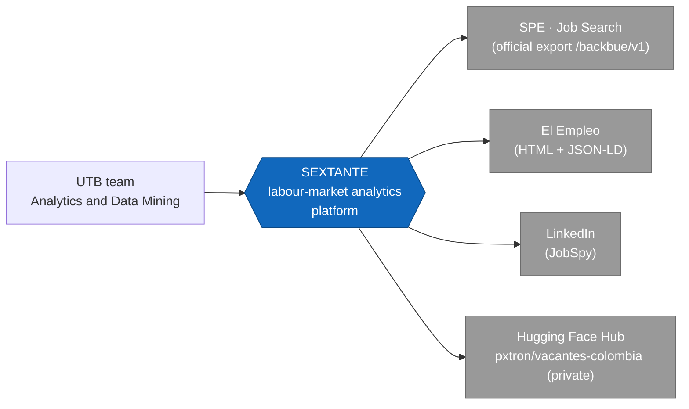
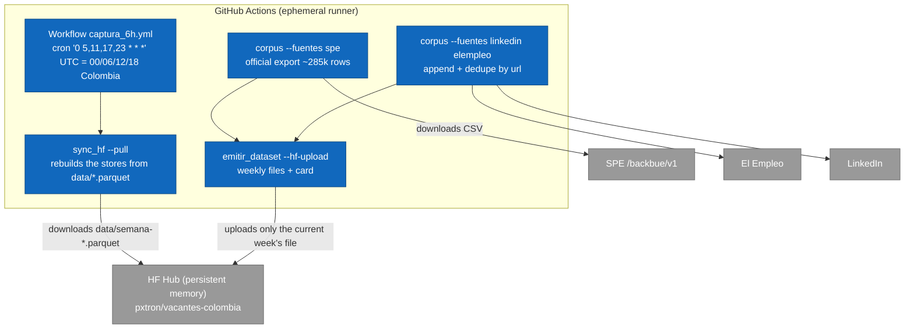
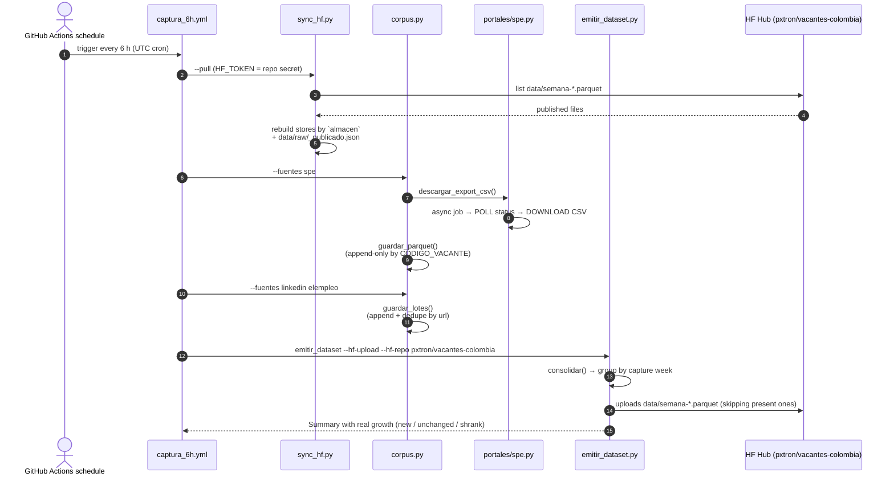

# SEXTANTE

> [Spanish](README.md) · [English](README.en.md) · [Architecture (C4 + flows)](docs/architecture.en.md)

Analytics and data-mining platform for navigating the Colombian labour market through skills, profiles, salaries and demand trends.

## Description

The real requirements of a position cannot always be inferred from the vacancy title. A title like "Junior Analyst" can represent very different roles with different duties and requirements, and the relevant information is usually found in the job description — written as free text, without a uniform taxonomy and with inconsistent vocabulary. This makes it hard to measure which skills the market really asks for, how much is paid for them, and how occupational profiles relate to each other.

SEXTANTE builds a processing pipeline that gathers job vacancies published in Colombia and turns their descriptions into structured data to:

- Identify demanded skills (extracted from the descriptions themselves, with an
  occupational signal).
- Analyse salary patterns.
- Group similar occupational profiles.
- Detect patterns or anomalies in labour demand.
- Build a skills–occupations graph to study relationships, communities and career transition paths.

## Team

| Name | ID |
| --- | --- |
| Alejandro Patrón Montero | T00078181 |
| Shalom Jhoana Arrieta Marrugo | T00082962 |
| Karla Andrea Barraza Torres | T00082880 |
| Katlyn Gutiérrez Cardona | T00082259 |

*Universidad Tecnológica de Bolívar — Analytics and Data Mining (Final project)*

## Objective

Develop an analytics and data-mining solution that helps understand the needs of the Colombian labour market by processing job vacancies — especially their textual descriptions — to identify the most demanded skills, characterise occupational profiles and analyse salary and demand patterns useful for candidates, employers and academic programmes.

## Current status

*Figures as of 2026-10-04; the corpus grows by ~35 k vacancies per week.*

- **Working extraction pipeline** (`src/extraccion/`): collects vacancies from **SPE** (official export), **El Empleo** and **LinkedIn** (via JobSpy), normalised to the **17-column canonical schema**.
- **Big SPE corpus**: `vacantes_spe.parquet` (319,765 unique vacancies accumulated per `CODIGO_VACANTE`, 2021→today, ~100% coverage of description, education level, department, salary range, contract and experience).
- **Curated corpus**: `data/raw/vacantes.csv` (2,548 vacancies from El Empleo + LinkedIn, deduplicated by `url`).
- **Published dataset**: **322,313 vacancies** in the private Hugging Face dataset **[`pxtron/vacantes-colombia`](https://huggingface.co/datasets/pxtron/vacantes-colombia)**, as **weekly** parquet files under `data/` (a vacancy lives in the file for the week it was first seen). There is no local database: the analytics layer reads from HF.
- **Append-only stores**: a vacancy already seen is **never rewritten**; `fecha_captura` is pinned to the first observation. That makes closed weeks immutable, so uploading drops from ~1.32 GB/day to ~58 MB/day — and it makes vacancy lifetime measurable.
- **Automatic cloud capture**: **GitHub Actions** workflow (private repo) every 6 hours. **Hugging Face is the pipeline's persistent memory**; the local cron is disabled and the corpus accumulates with no purges.
  - *Actual cadence*: the nominal cron is `0 5,11,17,23 UTC` (00/06/12/18 Colombia), but GitHub's scheduler does not honour it to the minute. Measured across 20 runs in September–October 2026: deviations range from −3.4 h to +2.6 h, with one ~8.8 h window with no run at all. The average stays at ~4 captures per day, but not at the documented hours.
- **Failures are visible**: if a source fails, the run ends red and the Actions Summary flags "no new vacancies" or "the corpus shrank".
- **Validation EDA**: `notebooks/eda_validacion.ipynb` (checks schema and field coverage).
- Next phases: contextual NLP, validated occupational mapping, and salary models.
- **Initial analytics milestone**: labour dashboard and bipartite job-title–term graph built with **endogenous vocabulary** (n-grams extracted from the descriptions plus an occupational signal), reading the private Hugging Face files without changing extraction.

## Architecture at a glance (C4 · Level 1 — Context)



Full C4 model (context, containers, components, deployment), capture sequences and data model in [`docs/architecture.en.md`](docs/architecture.en.md) (English) and [`docs/arquitectura.md`](docs/arquitectura.md) (Spanish).

## Pipeline data flow (cloud)



The runner is discarded when the job finishes; **the whole accumulated corpus lives in HF**. Each run rebuilds the local stores from the published files, appends newly seen vacancies and publishes the dataset again.

Real growth comes from vacancies not yet in the store, deduplicated by `CODIGO_VACANTE` (SPE) or `url` (curated); no purges. Because the stores are append-only, an already-seen vacancy is never rewritten, so files for closed weeks are **immutable** and `upload_folder` skips them (their content is already in the repo). Each run uploads only the current week's file: **~14 MB per run on average**, **~58 MB/day** (4 runs) against the previous layout's ~1.32 GB/day.

## Periodic capture (sequence)



> If a source fails, `corpus.py` exits with code 1: the run shows up red in Actions instead of republishing the same corpus and looking healthy.

## Methodology

- Exploratory data analysis and variable preparation.
- Dimensionality reduction with techniques such as PCA, t-SNE or UMAP.
- Supervised methods for estimation or classification tasks (e.g., expected salary).
- Unsupervised clustering methods: K-Means, hierarchical clustering and DBSCAN.
- Text mining and natural-language processing: cleaning, normalisation, TF-IDF, topic modelling and vector representations (Word2Vec, Spanish transformers).
- Web information extraction.
- Network and graph analytics via communities, centrality and path/connection algorithms.
- Distributed processing with Apache Spark when data volume justifies it.
- Data ethics, privacy, transparency and responsible use of results as cross-cutting axes.

## Data sources

| Source | Status | Detail |
| --- | --- | --- |
| **SPE – official export** (`buscadordeempleo.gov.co`) | Active | Full vacancy CSV export via API `/backbue/v1` (async job, official portal mechanism). ~285k rows per capture → canonical store deduplicated by `CODIGO_VACANTE`. ~100% coverage of description, department, education level, contract, salary and experience. |
| **El Empleo** (`elempleo.com/co/`) | Active | Public HTML (permissive robots.txt) + JSON-LD `JobPosting` details. |
| **LinkedIn** (via JobSpy) | Active | `python-jobspy`; full descriptions without authentication. |
| Computrabajo / Indeed / Glassdoor | Not viable | 403s/client errors; discarded without evasion (ethics). |

Full viability study and reasons in [`docs/viabilidad_fuentes.md`](docs/viabilidad_fuentes.md) and English version in [`docs/viabilidad_fuentes.en.md`](docs/viabilidad_fuentes.en.md).

## Canonical vacancy schema (17 columns)

This is the **single output contract** for all collectors (defined in `src/extraccion/esquema.py`):

`id_vacante, portal, url, titulo, empresa, ciudad, departamento, fecha_publicacion, descripcion, salario_texto, salario_min, salario_max, tipo_contrato, modalidad, nivel_educativo, experiencia_texto, fecha_captura`

| Column | Description |
| --- | --- |
| `id_vacante` | Unique offer identifier (`spe-<CODIGO_VACANTE>` in SPE; hash/link elsewhere). |
| `portal` | Origin source (`spe`, `elempleo`, `linkedin`). |
| `url` | Link to the original offer. |
| `titulo` | Job title. |
| `empresa` | Company/employer (`NOMBRE_PRESTADOR` in SPE). |
| `ciudad` | Offer city (`MUNICIPIO` in SPE). |
| `departamento` | Department (native in SPE, ~100%). |
| `fecha_publicacion` | Publication date as given by the source (variable format). |
| `descripcion` | Free-text offer description (NLP input). |
| `salario_texto` | Raw salary text (SPE bucket like `$1.500.001 - $2.000.000`). |
| `salario_min` / `salario_max` | Numeric range (COP/month) when derivable (~78% in SPE). |
| `tipo_contrato` | Contract type (SPE: ~100%). |
| `modalidad` | `Teletrabajo` if the source says so (SPE `TELETRABAJO=1`), or other value. |
| `nivel_educativo` | Required education level (native in SPE, ~100%). |
| `experiencia_texto` | Required experience text (SPE: "N months"). |
| `fecha_captura` | Capture timestamp `%Y-%m-%d %H:%M:%S`. Because the stores are append-only, it is the **first** time we saw the vacancy (not the last). |

Full data model (ER and dictionary) in `docs/architecture.en.md`.

## Project structure

```
SEXTANTE/
├── README.md                 # Documentación (español)
├── README.en.md              # Documentation (English)
├── AGENTS.md                 # Guide for AI agents working in this repo
├── requirements.txt
├── .github/workflows/
│   └── captura_6h.yml        # automatic capture every 6 h → Hugging Face
├── scripts/
│   └── capturar_6h.sh        # manual local capture (development)
├── data/
│   ├── raw/                  # vacantes.csv (curated seed corpus)
│   │   └── spe/              # vacantes_spe.parquet (canonical big-corpus seed)
│   ├── procesados/           # clean/enriched datasets (future use)
│   ├── snapshots/            # timestamped cuts of manual captures
│   └── emitido/              # weekly Hugging Face-ready dataset (parquet + card)
├── notebooks/
│   └── eda_validacion.ipynb
├── src/
│   ├── extraccion/           # Collection and emission pipeline
│   │   ├── esquema.py        #   17-column contract
│   │   ├── base.py           #   ethical HTTP, append-only save + snapshots
│   │   ├── corpus.py         #   orchestrator (python -m ...)
│   │   ├── sync_hf.py        #   rebuilds the stores from HF (--pull)
│   │   ├── emitir_dataset.py #   HF dataset by capture week
│   │   └── portales/
│   │       ├── spe.py               #   SPE (official export CSV → canonical parquet)
│   │       ├── elempleo.py          #   El Empleo (HTML + JSON-LD)
│   │       └── linkedin_jobspy.py   #   LinkedIn via JobSpy
│   ├── procesamiento/        # Cleaning, normalisation, NLP, embeddings (future)
│   ├── analisis/             # EDA, clustering, topics, models (future)
│   └── grafos/               # Skills–occupations graph (endogenous vocabulary)
└── docs/
    ├── integrantes.txt
    ├── viabilidad_fuentes.md / .en.md   # Source viability study (es/en)
    ├── arquitectura.md / architecture.en.md  # C4 model + flows + data (es/en)
```

## Usage

```bash
# 1. Environment (Python ≥ 3.10; venv created with uv in this setup)
uv venv                      # or: python -m venv .venv
uv pip install -r requirements.txt

# 2a. Big SPE corpus (official full export; ~3 requests to the portal)
.venv/bin/python -m src.extraccion.corpus --fuentes spe            # download export → parquet
.venv/bin/python -m src.extraccion.corpus --fuentes spe --spe-csv vacantes_spe_latest.csv  # reuse CSV

# 2b. Curated corpus appended to data/raw/vacantes.csv
.venv/bin/python -m src.extraccion.corpus                 # LinkedIn + El Empleo
.venv/bin/python -m src.extraccion.corpus --fuentes elempleo
.venv/bin/python -m src.extraccion.corpus --fuentes linkedin --linkedin-por-busqueda 25

# 2c. Emit the weekly dataset (HF directory; without --hf-upload nothing is published)
.venv/bin/python -m src.extraccion.emitir_dataset
HF_TOKEN=hf_xxx .venv/bin/python -m src.extraccion.emitir_dataset --hf-upload --hf-repo pxtron/vacantes-colombia

# 2d. Restore the accumulated corpus from Hugging Face (persistent memory)
HF_TOKEN=hf_xxx .venv/bin/python -m src.extraccion.sync_hf --pull --repo pxtron/vacantes-colombia

# 2e. Manual local capture (development); automatic capture runs in GitHub Actions
./scripts/capturar_6h.sh

# 3. Validate the corpus (run the notebook)
.venv/bin/jupyter nbconvert --to notebook --execute --inplace notebooks/eda_validacion.ipynb

# 4. Analytics dashboard (requires access to the private HF dataset)
hf auth login  # alternatively export HF_TOKEN outside the repository
.venv/bin/jupyter nbconvert --to notebook --execute --inplace notebooks/dashboard_metricas.ipynb

# 5. Graph (endogenous vocabulary; no external dependencies)
.venv/bin/python -m src.grafos.construir_grafo --repo pxtron/vacantes-colombia
.venv/bin/jupyter nbconvert --to notebook --execute --inplace notebooks/grafo_habilidades_ocupaciones.ipynb
```

Tests:

```bash
.venv/bin/python -m unittest discover -s tests
```

## Analytics and skills graph

`src/analisis/datos_hf.py` downloads only `data/*.parquet` from
`pxtron/vacantes-colombia`, uses the official cache, and records the resolved
revision. Because rows are frozen and each vacancy lives in a single file, the
load deduplicates by `id_vacante` as a safety net and normally drops nothing.
The dashboard covers quality, concentration, demand, experience, time trends,
and robust salary summaries. Missing modality remains unknown and SPE salaries
are treated as published ranges.

The graph uses **endogenous vocabulary**: instead of projecting the descriptions
onto an external taxonomy, it extracts n-grams from the descriptions themselves
and filters them by an occupational signal and frequency
(`src/procesamiento/habilidades.py`). The resulting job-title–term network is
bipartite and fully connected, which allows studying communities and transition
routes. Similarities and routes are exploratory co-occurrence signals, not
individual recommendations.

Because the stores are append-only, `fecha_captura` is the first observation:
together with `fecha_publicacion` it makes **vacancy lifetime** measurable.
That measurement was impossible while the corpus kept the last observed version.

Pandas and sparse matrices are sufficient at the current scale; Spark is
deferred to millions of texts, embeddings, or distributed NLP.

Each run **appends** new rows and stamps `fecha_captura`: `vacantes.csv`
deduplicates by `url`; the SPE parquet deduplicates by `id_vacante`
(`CODIGO_VACANTE`). In both cases a vacancy already present is never rewritten.

## Operations dashboard (where to see the data)

| Artefact | Path / resource |
| --- | --- |
| Log of each automatic capture | **Actions** tab of the repo (run Summary) |
| Published dataset (memory and product) | [huggingface.co/datasets/pxtron/vacantes-colombia](https://huggingface.co/datasets/pxtron/vacantes-colombia) — weekly files under [`data/`](https://huggingface.co/datasets/pxtron/vacantes-colombia/tree/main/data) |
| Counts from the last run | `data/emitido/vacantes-colombia/estado.json` (local) |
| Local curated corpus (seed/manual) | `data/raw/vacantes.csv` |
| Local canonical big corpus (seed/manual) | `data/raw/spe/vacantes_spe.parquet` |
| Local publish-ready dataset | `data/emitido/vacantes-colombia/` |

## Data ethics (cross-cutting axis)

Criteria adopted in `docs/viabilidad_fuentes.md` and its English version:

1. Respect `robots.txt` and each portal's terms of use.
2. No personal logins/cookies, proxies or block-evasion techniques.
3. Controlled volume with throttling (pause between requests) and an identifiable `User-Agent` (`SEXTANTE-UTB-university-research/1.0`).
4. Official source (SPE) as the legitimacy floor whenever available.
5. Only public offer information; no personal candidate data.
6. Provenance recorded per row in `portal` + `url`.

Robustness note: the SPE portal has an intermittent TLS certificate; `portales/spe.py` retries with `verify=False` **only after an SSL validation failure** (public, read-only state site, no authentication).

## Scope

The system presents trends, gaps and statistical signals; it is **not** intended to rate people, companies or educational institutions.
