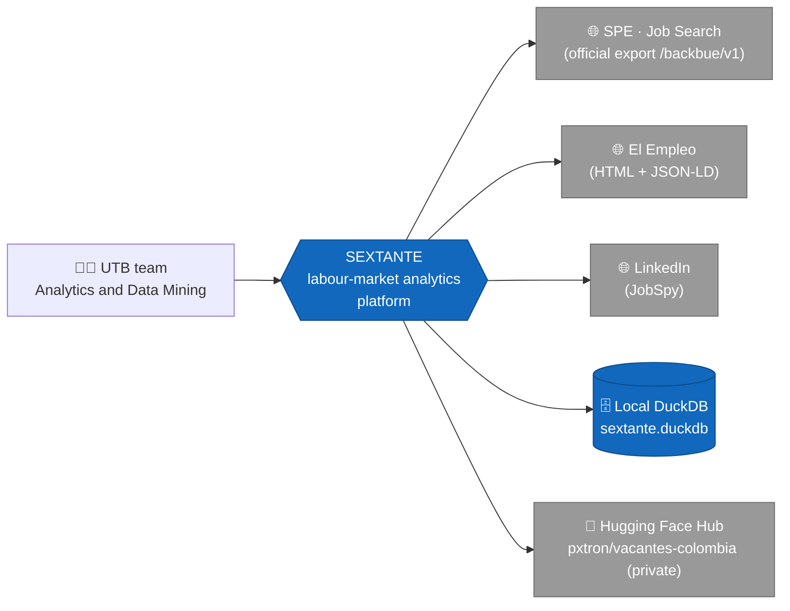
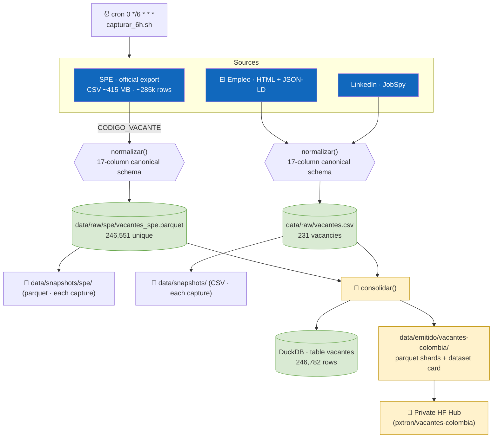
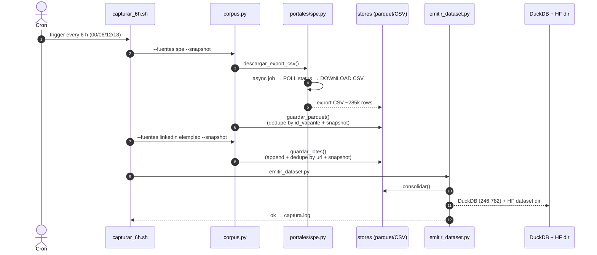

# SEXTANTE

> **🌐 English** · [Versión en español](README.md) · [Architecture (C4 + flows)](docs/architecture.en.md)

Analytics and data-mining platform for navigating the Colombian labour market through skills, profiles, salaries and demand trends.

## Description

The real requirements of a position cannot always be inferred from the vacancy title. A title like "Junior Analyst" can represent very different roles with different duties and requirements, and the relevant information is usually found in the job description — written as free text, without a uniform taxonomy and with inconsistent vocabulary. This makes it hard to measure which skills the market really asks for, how much is paid for them, and how occupational profiles relate to each other.

SEXTANTE builds a processing pipeline that gathers job vacancies published in Colombia and turns their descriptions into structured data to:

- Identify demanded skills (reference to the open ESCO taxonomy).
- Analyse salary patterns.
- Group similar occupational profiles.
- Detect patterns or anomalies in labour demand.
- Build a skills–occupations graph to study relationships, communities and career transition paths.

## Team

| Name | ID |
| --- | --- |
| Alejandro Patrón Montero | T00078181 |
| Shalom Jhoana Arrieta Marrugo | T00082962 |
| Karla Andrea Barraza Torres | T00082880 |
| Katlyn Gutiérrez Cardona | T00082259 |

*Universidad Tecnológica de Bolívar — Analytics and Data Mining (Final project)*

## Objective

Develop an analytics and data-mining solution that helps understand the needs of the Colombian labour market by processing job vacancies — especially their textual descriptions — to identify the most demanded skills, characterise occupational profiles and analyse salary and demand patterns useful for candidates, employers and academic programmes.

## Current status

- ✅ **Working extraction pipeline** (`src/extraccion/`): collects vacancies from **SPE** (offical export), **El Empleo** and **LinkedIn** (via JobSpy), normalised to the **17-column canonical schema**.
- ✅ **Big SPE corpus**: `data/raw/spe/vacantes_spe.parquet` (~246.5k unique vacancies accumulated per `CODIGO_VACANTE`, 2021→today, ~100% coverage of description, education level, department, salary range, contract and experience).
- ✅ **Curated corpus**: `data/raw/vacantes.csv` (231 vacancies from El Empleo + LinkedIn, deduplicated by `url`).
- ✅ **Unified dataset**: **246,782 vacancies** in local DuckDB (`data/duckdb/sextante.duckdb`, table `vacantes`) and a private Hugging Face dataset **[`pxtron/vacantes-colombia`](https://huggingface.co/datasets/pxtron/vacantes-colombia)** (5 parquet shards). Local publish-ready directory at `data/emitido/vacantes-colombia/`.
- ✅ **Automatic periodic capture**: cron `0 */6 * * *` (00:00, 06:00, 12:00, 18:00) runs `scripts/capturar_6h.sh` (SPE + curated + emission). Log at `data/snapshots/captura.log`, timestamped snapshots in `data/snapshots/`.
- ✅ **Validation EDA**: `notebooks/eda_validacion.ipynb` (checks schema and field coverage).
- ⏳ Next: `procesamiento/`, `analisis/` and `grafos/` modules (NLP/ESCO skills, salary clustering, occupation graphs; possible Apache Spark depending on volume).

## Architecture at a glance (C4 · Level 1 — Context)



Full C4 model (context, containers, components, deployment), capture sequences and data model in [`docs/architecture.en.md`](docs/architecture.en.md) (English) and [`docs/arquitectura.md`](docs/arquitectura.md) (Spanish).

## Pipeline data flow



## Periodic capture (sequence)



## Methodology

- Exploratory data analysis and variable preparation.
- Dimensionality reduction with techniques such as PCA, t-SNE or UMAP.
- Supervised methods for estimation or classification tasks (e.g., expected salary).
- Unsupervised clustering methods: K-Means, hierarchical clustering and DBSCAN.
- Text mining and natural-language processing: cleaning, normalisation, TF-IDF, topic modelling and vector representations (Word2Vec, Spanish transformers).
- Web information extraction.
- Network and graph analytics via communities, centrality and path/connection algorithms.
- Distributed processing with Apache Spark when data volume justifies it.
- Data ethics, privacy, transparency and responsible use of results as cross-cutting axes.

## Data sources

| Source | Status | Detail |
| --- | --- | --- |
| **SPE – official export** (`buscadordeempleo.gov.co`) | ✔ Active | Full vacancy CSV export via API `/backbue/v1` (async job, official portal mechanism). ~285k rows per capture → canonical store deduplicated by `CODIGO_VACANTE`. ~100% coverage of description, department, education level, contract, salary and experience. |
| **El Empleo** (`elempleo.com/co/`) | ✔ Active | Public HTML (permissive robots.txt) + JSON-LD `JobPosting` details. |
| **LinkedIn** (via JobSpy) | ✔ Active | `python-jobspy`; full descriptions without authentication. |
| Computrabajo / Indeed / Glassdoor | ✘ Not viable | 403s/client errors; discarded without evasion (ethics). |

Full viability study and reasons in [`docs/viabilidad_fuentes.md`](docs/viabilidad_fuentes.md) and English version in [`docs/viabilidad_fuentes.en.md`](docs/viabilidad_fuentes.en.md).

## Canonical vacancy schema (17 columns)

This is the **single output contract** for all collectors (defined in `src/extraccion/esquema.py`):

`id_vacante, portal, url, titulo, empresa, ciudad, departamento, fecha_publicacion, descripcion, salario_texto, salario_min, salario_max, tipo_contrato, modalidad, nivel_educativo, experiencia_texto, fecha_captura`

| Column | Description |
| --- | --- |
| `id_vacante` | Unique offer identifier (`spe-<CODIGO_VACANTE>` in SPE; hash/link elsewhere). |
| `portal` | Origin source (`spe`, `elempleo`, `linkedin`). |
| `url` | Link to the original offer. |
| `titulo` | Job title. |
| `empresa` | Company/employer (`NOMBRE_PRESTADOR` in SPE). |
| `ciudad` | Offer city (`MUNICIPIO` in SPE). |
| `departamento` | Department (native in SPE, ~100%). |
| `fecha_publicacion` | Publication date as given by the source (variable format). |
| `descripcion` | Free-text offer description (NLP input). |
| `salario_texto` | Raw salary text (SPE bucket like `$1.500.001 - $2.000.000`). |
| `salario_min` / `salario_max` | Numeric range (COP/month) when derivable (~78% in SPE). |
| `tipo_contrato` | Contract type (SPE: ~100%). |
| `modalidad` | `Teletrabajo` if the source says so (SPE `TELETRABAJO=1`), or other value. |
| `nivel_educativo` | Required education level (native in SPE, ~100%). |
| `experiencia_texto` | Required experience text (SPE: "N months"). |
| `fecha_captura` | Capture timestamp `%Y-%m-%d %H:%M:%S`. |

Full data model (ER and dictionary) in `docs/architecture.en.md`.

## Project structure

```
SEXTANTE/
├── README.md                 # Documentación (español)
├── README.en.md              # Documentation (English)
├── AGENTS.md                 # Guide for AI agents working in this repo
├── requirements.txt
├── scripts/
│   └── capturar_6h.sh        # periodic capture (SPE + curated + emission; cron 0 */6 * * *)
├── data/
│   ├── raw/                  # vacantes.csv (accumulated curated corpus)
│   │   └── spe/              # vacantes_spe.parquet (canonical big corpus) [+ export csv]
│   ├── procesados/           # clean/enriched datasets (future use)
│   ├── snapshots/            # timestamped cuts of each capture (+ captura.log)
│   ├── emitido/              # Hugging Face-ready dataset (parquet + card)
│   └── duckdb/               # sextante.duckdb (vacantes table, local)
├── notebooks/
│   └── eda_validacion.ipynb
├── src/
│   ├── extraccion/           # Collection and emission pipeline
│   │   ├── esquema.py        #   17-column contract
│   │   ├── base.py           #   ethical HTTP, save + dedupe + snapshots
│   │   ├── corpus.py         #   orchestrator (python -m ...)
│   │   ├── emitir_dataset.py #   local DuckDB + Hugging Face dataset
│   │   └── portales/
│   │       ├── spe.py               #   SPE (official export CSV → canonical parquet)
│   │       ├── elempleo.py          #   El Empleo (HTML + JSON-LD)
│   │       └── linkedin_jobspy.py   #   LinkedIn via JobSpy
│   ├── procesamiento/        # Cleaning, normalisation, NLP, embeddings (future)
│   ├── analisis/             # EDA, clustering, topics, models (future)
│   └── grafos/               # Skills–occupations graph (future)
└── docs/
    ├── integrantes.txt
    ├── viabilidad_fuentes.md / .en.md   # Source viability study (es/en)
    ├── arquitectura.md / architecture.en.md  # C4 model + flows + data (es/en)
```

## Usage

```bash
# 1. Environment (Python ≥ 3.10; venv created with uv in this setup)
uv venv                      # or: python -m venv .venv
uv pip install -r requirements.txt

# 2a. Big SPE corpus (official full export; ~3 requests to the portal)
.venv/bin/python -m src.extraccion.corpus --fuentes spe            # download export → parquet
.venv/bin/python -m src.extraccion.corpus --fuentes spe --spe-csv vacantes_spe_latest.csv  # reuse CSV
.venv/bin/python -m src.extraccion.corpus --fuentes spe --snapshot  # + timestamped snapshot

# 2b. Curated corpus appended to data/raw/vacantes.csv
.venv/bin/python -m src.extraccion.corpus                 # LinkedIn + El Empleo
.venv/bin/python -m src.extraccion.corpus --fuentes elempleo
.venv/bin/python -m src.extraccion.corpus --fuentes linkedin --linkedin-por-busqueda 25

# 2c. Emit the unified dataset (local DuckDB + HF directory)
.venv/bin/python -m src.extraccion.emitir_dataset
HF_TOKEN=hf_xxx .venv/bin/python -m src.extraccion.emitir_dataset --hf-upload --hf-repo YOUR_USER/vacantes-colombia  # private HF dataset

# 2d. Periodic capture every 6 h (see scripts/capturar_6h.sh for the cron)
./scripts/capturar_6h.sh

# 3. Validate the corpus (run the notebook)
.venv/bin/jupyter nbconvert --to notebook --execute --inplace notebooks/eda_validacion.ipynb
```

Each run **appends** new rows and stamps `fecha_captura`: `vacantes.csv` deduplicates by `url`; the SPE parquet deduplicates by `id_vacante` (`CODIGO_VACANTE`).

## Operations dashboard (where to see the data)

| Artefact | Path / resource |
| --- | --- |
| Log of each automatic capture | `data/snapshots/captura.log` |
| Snapshot cuts (curated / SPE) | `data/snapshots/vacantes_*.csv` · `data/snapshots/spe/vacantes_spe_*.parquet` |
| Accumulated curated corpus | `data/raw/vacantes.csv` |
| Canonical big corpus | `data/raw/spe/vacantes_spe.parquet` |
| Unified local database | `data/duckdb/sextante.duckdb` (`vacantes` table) |
| Publish-ready dataset | `data/emitido/vacantes-colombia/` |
| Published private dataset | [huggingface.co/datasets/pxtron/vacantes-colombia](https://huggingface.co/datasets/pxtron/vacantes-colombia) |
| Active crontab | `crontab -l` (daemon: `systemctl status cron`) |

## Data ethics (cross-cutting axis)

Criteria adopted in `docs/viabilidad_fuentes.md` and its English version:

1. Respect `robots.txt` and each portal's terms of use.
2. No personal logins/cookies, proxies or block-evasion techniques.
3. Controlled volume with throttling (pause between requests) and an identifiable `User-Agent` (`SEXTANTE-UTB-university-research/1.0`).
4. Official source (SPE) as the legitimacy floor whenever available.
5. Only public offer information; no personal candidate data.
6. Provenance recorded per row in `portal` + `url`.

Robustness note: the SPE portal has an intermittent TLS certificate; `portales/spe.py` retries with `verify=False` **only after an SSL validation failure** (public, read-only state site, no authentication).

## Scope

The system presents trends, gaps and statistical signals; it is **not** intended to rate people, companies or educational institutions.