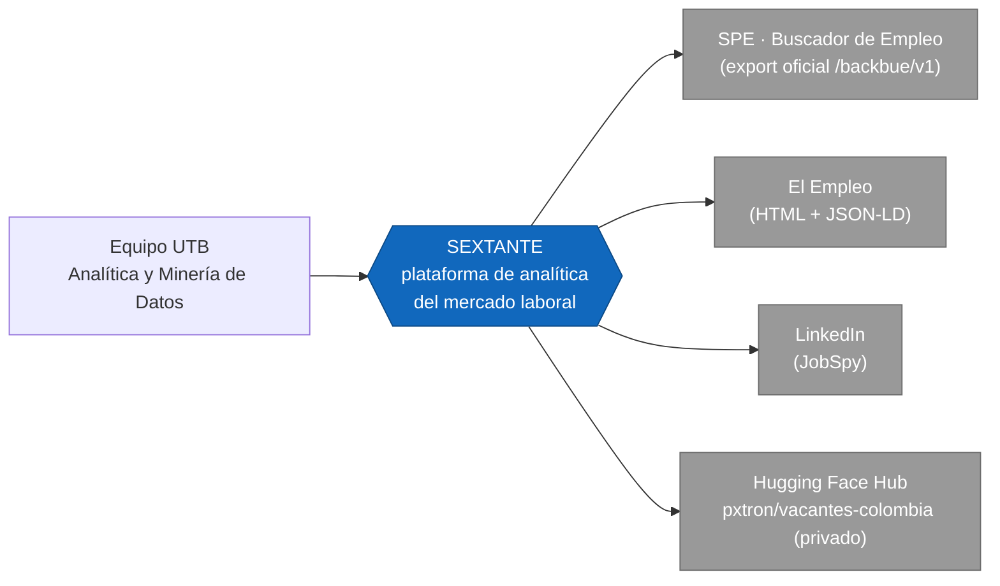
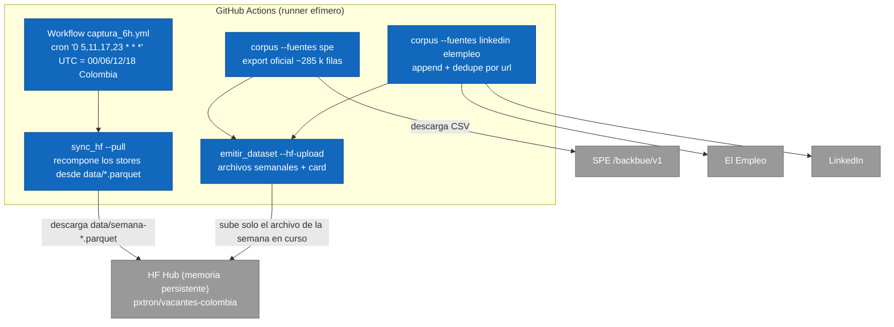
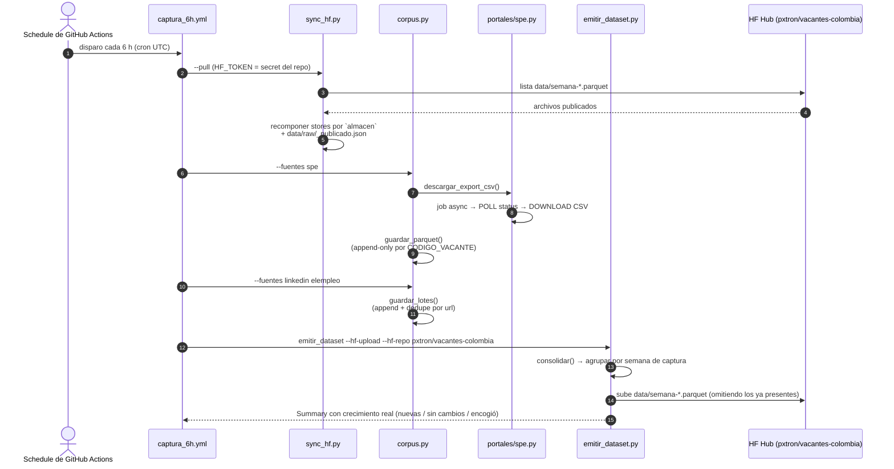

# SEXTANTE

> [Español](README.md) · [English version](README.en.md) · [Arquitectura (C4 + flujos)](docs/arquitectura.md)

Plataforma de analítica y minería de datos para navegar el mercado laboral colombiano a través de habilidades, perfiles, salarios y tendencias de demanda.

## Descripción

Los requisitos reales de un cargo no siempre pueden conocerse a partir del título de la vacante. Un título como "Analista junior" puede representar trabajos con funciones y requisitos muy diferentes, y la información relevante suele estar en la descripción de la oferta, escrita como texto libre, sin una taxonomía uniforme y con vocabulario inconsistente. Esto dificulta medir qué habilidades solicita realmente el mercado, cuánto se paga por ellas y cómo se relacionan los perfiles ocupacionales.

SEXTANTE desarrolla un flujo de procesamiento que recopila vacantes laborales publicadas en Colombia y transforma sus descripciones en datos estructurados para:

- Identificar habilidades demandadas (extraídas de las propias descripciones, con
  una señal ocupacional).
- Analizar patrones salariales.
- Agrupar perfiles ocupacionales semejantes.
- Detectar patrones o anomalías en la demanda laboral.
- Construir un grafo de habilidades y ocupaciones para estudiar relaciones, comunidades y rutas de transición laboral.

## Integrantes

| Nombre | Código |
| --- | --- |
| Alejandro Patrón Montero | T00078181 |
| Shalom Jhoana Arrieta Marrugo | T00082962 |
| Karla Andrea Barraza Torres | T00082880 |
| Katlyn Gutiérrez Cardona | T00082259 |

*Universidad Tecnológica de Bolívar — Análítica y Minería de Datos (Proyecto final)*

## Objetivo

Desarrollar una solución de analítica y minería de datos que permita comprender las necesidades del mercado laboral colombiano mediante el procesamiento de vacantes, especialmente de sus descripciones textuales, para identificar las habilidades más demandadas, caracterizar perfiles ocupacionales y analizar patrones salariales y de demanda útiles para candidatos, empleadores y programas académicos.

## Estado actual

*Cifras de 2026-10-04; el corpus crece ~35 k vacantes por semana.*

- **Pipeline de extracción funcional** (`src/extraccion/`): recolecta vacantes desde **SPE** (export oficial), **El Empleo** y **LinkedIn** (vía JobSpy) y las normaliza al **esquema canónico de 17 columnas**.
- **Corpus grande SPE**: `vacantes_spe.parquet` (319.765 vacantes únicas acumuladas por `CODIGO_VACANTE`, 2021→hoy, cobertura ~100% en descripción, nivel educativo, departamento, rango salarial, contrato y experiencia).
- **Corpus curado**: `data/raw/vacantes.csv` (2.548 vacantes de El Empleo + LinkedIn, sin duplicados por `url`).
- **Dataset publicado**: **322.313 vacantes** en el dataset Hugging Face privado **[`pxtron/vacantes-colombia`](https://huggingface.co/datasets/pxtron/vacantes-colombia)**, como archivos parquet **semanales** bajo `data/` (una vacante vive en el archivo de la semana en que la vimos por primera vez). No hay base local: la capa analítica lee de HF.
- **Stores append-only**: una vacante ya vista **no se reescribe**; `fecha_captura` queda fijada a la primera observación. Eso permite medir permanencia de la vacante y hace que los archivos de semanas cerradas sean inmutables (subir pasa de ~1,32 GB/día a ~58 MB/día).
- **Captura automática en la nube**: workflow de **GitHub Actions** (repo privado) cada 6 horas. **Hugging Face es la memoria persistente** del pipeline; el cron local está desactivado y el corpus se acumula sin purgas.
  - *Cadencia real*: el cron nominal es `0 5,11,17,23 UTC` (00/06/12/18 Colombia), pero el planificador de GitHub no lo respeta al minuto. Medido sobre 20 corridas de septiembre–octubre de 2026: los desvíos van de −3,4 h a +2,6 h y hay una ventana sin corridas de ~8,8 h. El promedio se mantiene en ~4 capturas diarias, pero no a las horas documentadas.
- **Fallos visibles**: si una fuente falla, la corrida termina en rojo y el Summary de Actions marca "sin vacantes nuevas" o "el corpus se encogió".
- **EDA de validación**: `notebooks/eda_validacion.ipynb` (verifica esquema y cobertura de campos).
- Siguientes fases: NLP contextual, homologación ocupacional y modelos salariales.
- **Avance analítico inicial**: dashboard laboral y grafo bipartito cargo–habilidad con **vocabulario endógeno** (n-gramas extraídos de las descripciones + señal ocupacional), leyendo los archivos privados de Hugging Face sin modificar la extracción.

## Arquitectura en una vista (C4 · Nivel 1 — Contexto)



Diagramas completos del modelo C4 (contexto, contenedores, componentes, despliegue), secuencias de captura y modelo de datos en [`docs/arquitectura.md`](docs/arquitectura.md) (en español) y [`docs/architecture.en.md`](docs/architecture.en.md) (en inglés).

## Flujo de datos del pipeline (nube)



El runner se descarta al terminar; **todo el corpus acumulado vive en HF**. Cada corrida recompon los stores locales desde los archivos publicados, le agrega las vacantes nuevas y vuelve a subir el dataset.

El crecimiento real proviene de las vacantes nuevas que aún no existían, deduplicadas por `CODIGO_VACANTE` (SPE) o por `url` (curado); no hay purgas. Como los stores son append-only, una vacante ya vista no se reescribe: eso hace que los archivos de semanas cerradas sean **inmutables**, y `upload_folder` los omite porque su contenido ya está en el repo. En cada corrida solo se sube el archivo de la semana en curso: media de **~14 MB por corrida**, **~58 MB/día** (4 corridas) frente a los ~1,32 GB/día del layout anterior.

## Captura periódica (secuencia)



> Si una fuente falla, `corpus.py` termina con código 1: la corrida aparece en rojo en Actions en vez de republicar el mismo corpus y parecer sano.

## Metodología

- Análisis exploratorio de datos y preparación de variables.
- Reducción de dimensionalidad con técnicas como PCA, t-SNE o UMAP.
- Métodos supervisados para tareas de estimación o clasificación (p. ej., salario esperado).
- Métodos no supervisados de agrupamiento: K-Means, agrupamiento jerárquico y DBSCAN.
- Minería de texto y procesamiento de lenguaje natural: limpieza, normalización, TF-IDF, modelado de tópicos y representaciones vectoriales (Word2Vec, transformadores en español).
- Extracción de información desde fuentes web.
- Analítica de redes y grafos mediante comunidades, centralidad y algoritmos de rutas o conexión.
- Procesamiento distribuido con Apache Spark cuando el volumen de datos lo justifique.
- Ética de datos, privacidad, transparencia y uso responsable de los resultados como ejes transversales.

## Fuentes de datos

| Fuente | Estado | Detalle |
| --- | --- | --- |
| **SPE – export oficial** (`buscadordeempleo.gov.co`) | Activa | Export CSV total de vacantes vía API `/backbue/v1` (job asíncrono, mecanismo oficial del portal). ~285 k filas por captura → store canónico deduplicado por `CODIGO_VACANTE`. Cobertura ~100% en descripción, departamento, nivel educativo, contrato, salario y experiencia. |
| **El Empleo** (`elempleo.com/co/`) | Activa | HTML público (robots.txt permisivo) + detalle JSON-LD `JobPosting`. |
| **LinkedIn** (vía JobSpy) | Activa | `python-jobspy`; descripciones completas sin autenticación. |
| Computrabajo / Indeed / Glassdoor | No viable | Bloqueos 403/errores de cliente; se descartan sin evasión (ética). |

La viabilidad completa y los motivos están en [`docs/viabilidad_fuentes.md`](docs/viabilidad_fuentes.md) y su versión en inglés en [`docs/viabilidad_fuentes.en.md`](docs/viabilidad_fuentes.en.md).

## Esquema canónico de vacantes (17 columnas)

Es el **único contrato de salida** de los colectores (definido en `src/extraccion/esquema.py`):

`id_vacante, portal, url, titulo, empresa, ciudad, departamento, fecha_publicacion, descripcion, salario_texto, salario_min, salario_max, tipo_contrato, modalidad, nivel_educativo, experiencia_texto, fecha_captura`

| Columna | Descripción |
| --- | --- |
| `id_vacante` | Identificador único de la oferta (`spe-<CODIGO_VACANTE>` en SPE; hash/link en las demás). |
| `portal` | Fuente de origen (`spe`, `elempleo`, `linkedin`). |
| `url` | Enlace a la oferta original. |
| `titulo` | Título del cargo. |
| `empresa` | Empresa/empleador (`NOMBRE_PRESTADOR` en SPE). |
| `ciudad` | Ciudad de la oferta (`MUNICIPIO` en SPE). |
| `departamento` | Departamento (nativo en SPE, ~100%). |
| `fecha_publicacion` | Fecha tal cual la da la fuente (formato variable). |
| `descripcion` | Texto libre de la oferta (insumo del NLP). |
| `salario_texto` | Texto original del salario (SPE: bucket como `$1.500.001 - $2.000.000`). |
| `salario_min` / `salario_max` | Rango numérico (COP/mes) cuando es derivable (~78% en SPE). |
| `tipo_contrato` | Tipo de contrato (SPE: ~100%). |
| `modalidad` | `Teletrabajo` si la fuente lo indica (SPE `TELETRABAJO=1`), u otro valor. |
| `nivel_educativo` | Nivel de estudios requerido (nativo en SPE, ~100%). |
| `experiencia_texto` | Texto de experiencia requerida (SPE: "N meses"). |
| `fecha_captura` | Estampa de captura `%Y-%m-%d %H:%M:%S`. Como los stores son append-only, es la **primera** vez que vimos la vacante (no la última). |

El modelo de datos completo (ER y diccionario) está en `docs/arquitectura.md`.

## Estructura del proyecto

```
SEXTANTE/
├── README.md                 # Documentación (español)
├── README.en.md              # Documentation (English)
├── AGENTS.md                 # Guía para agentes de IA que trabajen en el repo
├── requirements.txt          # pipeline de captura (pineado)
├── requirements-notebooks.txt  # análisis y grafos (no lo usa el cron)
├── .github/workflows/
│   └── captura_6h.yml        # captura automática cada 6 h → Hugging Face
├── scripts/
│   └── capturar_6h.sh        # captura manual local (desarrollo)
├── data/
│   ├── raw/                  # vacantes.csv (corpus curado acumulado, semilla)
│   │   └── spe/              # vacantes_spe.parquet (corpus grande canónico, semilla)
│   ├── procesados/           # datasets limpios/enriquecidos (uso futuro)
│   ├── snapshots/            # cortes con marca de tiempo de capturas manuales
│   └── emitido/              # dataset semanal listo para Hugging Face (parquet + card)
├── notebooks/
│   └── eda_validacion.ipynb
├── src/
│   ├── extraccion/           # Pipeline de recolección y emisión
│   │   ├── esquema.py        #   contrato de 17 columnas
│   │   ├── base.py           #   HTTP ético, guardado append-only + snapshots
│   │   ├── corpus.py         #   orquestador (python -m ...)
│   │   ├── sync_hf.py        #   recompone los stores desde HF (--pull)
│   │   ├── emitir_dataset.py #   dataset HF por semanas de captura
│   │   └── portales/
│   │       ├── spe.py               #   SPE (export oficial CSV → parquet canónico)
│   │       ├── elempleo.py          #   El Empleo (HTML + JSON-LD)
│   │       └── linkedin_jobspy.py   #   LinkedIn vía JobSpy
│   ├── procesamiento/        # Limpieza, normalización, NLP, embeddings (uso futuro)
│   ├── analisis/             # EDA, clustering, tópicos, modelos (uso futuro)
│   └── grafos/               # Grafo habilidades-ocupaciones (vocabulario endógeno)
└── docs/
    ├── integrantes.txt
    ├── viabilidad_fuentes.md / .en.md   # Estudio de fuentes (esp/en)
    ├── arquitectura.md / architecture.en.md  # Modelo C4 + flujos + datos (esp/en)
```

## Uso

```bash
# 1. Entorno (Python ≥ 3.10; venv creado con uv en este ambiente)
uv venv                      # o: python -m venv .venv
uv pip install -r requirements.txt            # pipeline de captura (lo que corre el cron)
uv pip install -r requirements-notebooks.txt  # + análisis, grafos y notebooks

# 2a. Corpus grande SPE (export oficial total; ~3 peticiones al portal)
.venv/bin/python -m src.extraccion.corpus --fuentes spe            # descarga export → parquet
.venv/bin/python -m src.extraccion.corpus --fuentes spe --spe-csv vacantes_spe_latest.csv  # reusa CSV

# 2b. Corpus curado y añadirlo a data/raw/vacantes.csv
.venv/bin/python -m src.extraccion.corpus                 # LinkedIn + El Empleo
.venv/bin/python -m src.extraccion.corpus --fuentes elempleo
.venv/bin/python -m src.extraccion.corpus --fuentes linkedin --linkedin-por-busqueda 25

# 2c. Emitir el dataset por semanas (directorio HF; sin --hf-upload no publica)
.venv/bin/python -m src.extraccion.emitir_dataset
HF_TOKEN=hf_xxx .venv/bin/python -m src.extraccion.emitir_dataset --hf-upload --hf-repo pxtron/vacantes-colombia

# 2d. Restaurar el corpus acumulado desde Hugging Face (memoria persistente)
HF_TOKEN=hf_xxx .venv/bin/python -m src.extraccion.sync_hf --pull --repo pxtron/vacantes-colombia

# 2e. Captura manual local (desarrollo); la captura automática corre en GitHub Actions
./scripts/capturar_6h.sh

# 3. Validar el corpus (ejecutar el notebook)
.venv/bin/jupyter nbconvert --to notebook --execute --inplace notebooks/eda_validacion.ipynb

# 4. Dashboard analítico (requiere acceso al dataset privado de HF)
hf auth login  # alternativa: exportar HF_TOKEN fuera del repositorio
.venv/bin/jupyter nbconvert --to notebook --execute --inplace notebooks/dashboard_metricas.ipynb

# 5. Grafo (vocabulario endógeno; sin dependencias externas)
.venv/bin/python -m src.grafos.construir_grafo --repo pxtron/vacantes-colombia
.venv/bin/jupyter nbconvert --to notebook --execute --inplace notebooks/grafo_habilidades_ocupaciones.ipynb
```

Pruebas:

```bash
.venv/bin/python -m unittest discover -s tests
```

## Analítica y grafo de habilidades

`src/analisis/datos_hf.py` descarga solamente `data/*.parquet` de
`pxtron/vacantes-colombia`, usa la caché oficial y registra la revisión resuelta.
Como las filas están congeladas y cada vacante vive en un solo archivo, la carga
deduplica por `id_vacante` como red de seguridad y normalmente no descarta nada. El
dashboard calcula cobertura, concentración, demanda, experiencia,
temporalidad y salarios robustos. Los nulos de modalidad siguen siendo
desconocidos y los salarios SPE se interpretan como rangos publicados.

El grafo usa **vocabulario endógeno**: en lugar de proyectar las descripciones
sobre una taxonomía externa, extrae n-gramas de las propias descripciones y los
filtra por señal ocupacional y frecuencia (`src/procesamiento/habilidades.py`).
La red resultante es bipartita cargo–término y totalmente conexa, lo que permite
estudiar comunidades y rutas de transición. Las similitudes y rutas son señales
exploratorias de coocurrencia, no recomendaciones individuales.

Como los stores son append-only, `fecha_captura` es la primera observación:
junto con `fecha_publicacion` permite medir **cuánto tiempo permaneció abierta
cada vacante**. Esa medición no era posible cuando el corpus guardaba la última
versión observada.

Pandas y matrices dispersas bastan para el volumen actual; Spark se reserva
para millones de textos, embeddings o NLP distribuido.

Cada corrida **añade** filas nuevas y estampa `fecha_captura`: `vacantes.csv` deduplica por `url`; el parquet del SPE deduplica por `id_vacante` (`CODIGO_VACANTE`). En ambos casos una vacante ya presente no se reescribe.

## Tablero de operación (dónde ver los datos)

| Artefacto | Ruta / recurso |
| --- | --- |
| Log de cada captura automática | Pestaña **Actions** del repo (Summary de cada corrida) |
| Dataset publicado (memoria y producto) | [huggingface.co/datasets/pxtron/vacantes-colombia](https://huggingface.co/datasets/pxtron/vacantes-colombia) — archivos semanales en [`data/`](https://huggingface.co/datasets/pxtron/vacantes-colombia/tree/main/data) |
| Conteos de la última corrida | `data/emitido/vacantes-colombia/estado.json` (local) |
| Corpus curado local (semilla/uso manual) | `data/raw/vacantes.csv` |
| Corpus grande canónico local (semilla/uso manual) | `data/raw/spe/vacantes_spe.parquet` |
| Dataset local para publicar | `data/emitido/vacantes-colombia/` |

## Ética de datos (eje transversal)

Criterios adoptados en `docs/viabilidad_fuentes.md` y su versión en inglés:

1. Respetar `robots.txt` y términos de uso de cada portal.
2. Sin login/cookies personales, proxies ni evasión de bloqueos.
3. Volumen controlado con throttling (pausa entre peticiones) y `User-Agent` identificable (`SEXTANTE-UTB-university-research/1.0`).
4. Fuente oficial (SPE) como piso de legitimidad cuando esté disponible.
5. Solo información pública de ofertas; sin datos personales de candidatos.
6. Procedencia registrada por registro en `portal` + `url`.

Nota de robustez: el portal del SPE presenta un certificado TLS intermitente; `portales/spe.py` reintenta con `verify=False` **solo ante fallo de validación SSL** (sitio estatal público y de solo lectura, sin autenticación).

## Alcance

El sistema presenta tendencias, brechas y señales estadísticas; **no** tiene como propósito calificar personas, empresas ni instituciones educativas.
