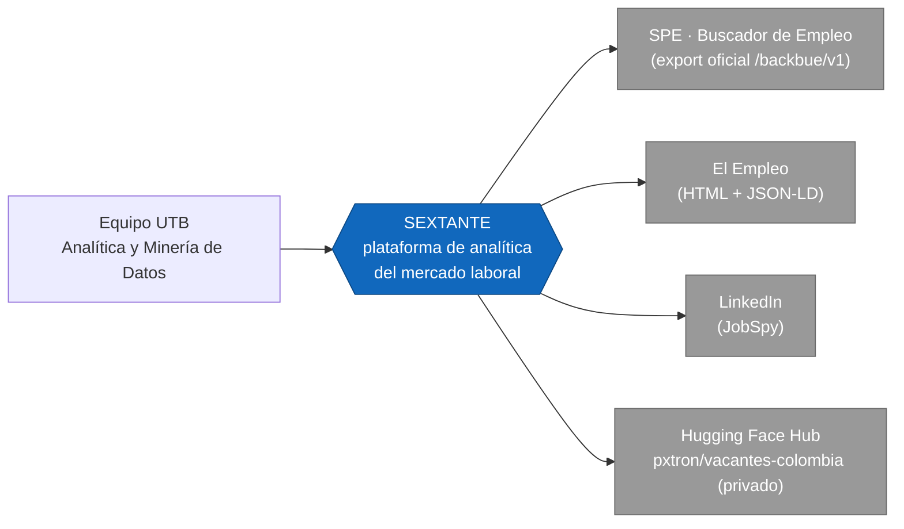
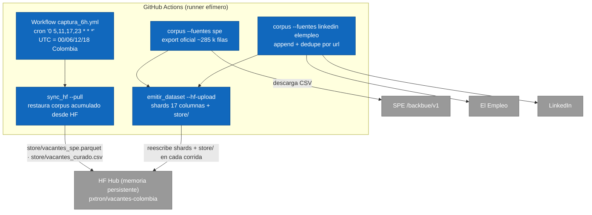
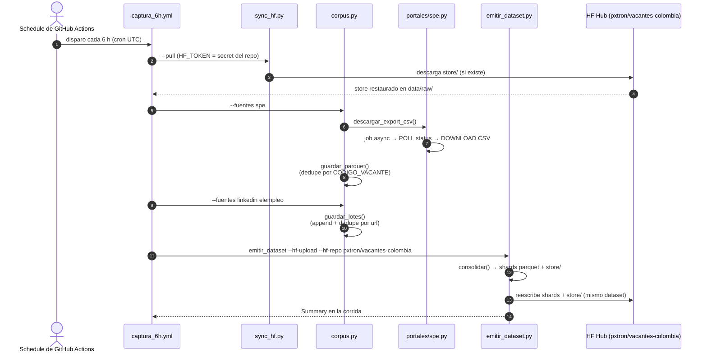

# SEXTANTE

> [Español](README.md) · [English version](README.en.md) · [Arquitectura (C4 + flujos)](docs/arquitectura.md)

Plataforma de analítica y minería de datos para navegar el mercado laboral colombiano a través de habilidades, perfiles, salarios y tendencias de demanda.

## Descripción

Los requisitos reales de un cargo no siempre pueden conocerse a partir del título de la vacante. Un título como "Analista junior" puede representar trabajos con funciones y requisitos muy diferentes, y la información relevante suele estar en la descripción de la oferta, escrita como texto libre, sin una taxonomía uniforme y con vocabulario inconsistente. Esto dificulta medir qué habilidades solicita realmente el mercado, cuánto se paga por ellas y cómo se relacionan los perfiles ocupacionales.

SEXTANTE desarrolla un flujo de procesamiento que recopila vacantes laborales publicadas en Colombia y transforma sus descripciones en datos estructurados para:

- Identificar habilidades demandadas (referencia a la taxonomía abierta ESCO).
- Analizar patrones salariales.
- Agrupar perfiles ocupacionales semejantes.
- Detectar patrones o anomalías en la demanda laboral.
- Construir un grafo de habilidades y ocupaciones para estudiar relaciones, comunidades y rutas de transición laboral.

## Integrantes

| Nombre | Código |
| --- | --- |
| Alejandro Patrón Montero | T00078181 |
| Shalom Jhoana Arrieta Marrugo | T00082962 |
| Karla Andrea Barraza Torres | T00082880 |
| Katlyn Gutiérrez Cardona | T00082259 |

*Universidad Tecnológica de Bolívar — Análítica y Minería de Datos (Proyecto final)*

## Objetivo

Desarrollar una solución de analítica y minería de datos que permita comprender las necesidades del mercado laboral colombiano mediante el procesamiento de vacantes, especialmente de sus descripciones textuales, para identificar las habilidades más demandadas, caracterizar perfiles ocupacionales y analizar patrones salariales y de demanda útiles para candidatos, empleadores y programas académicos.

## Estado actual

- **Pipeline de extracción funcional** (`src/extraccion/`): recolecta vacantes desde **SPE** (export oficial), **El Empleo** y **LinkedIn** (vía JobSpy) y las normaliza al **esquema canónico de 17 columnas**.
- **Corpus grande SPE**: `vacantes_spe.parquet` (~246,5k vacantes únicas acumuladas por `CODIGO_VACANTE`, 2021→hoy, cobertura ~100% en descripción, nivel educativo, departamento, rango salarial, contrato y experiencia).
- **Corpus curado**: `data/raw/vacantes.csv` (231 vacantes de El Empleo + LinkedIn, sin duplicados por `url`).
- **Dataset unificado**: **246.782 vacantes** en DuckDB local (`data/duckdb/sextante.duckdb`, tabla `vacantes`) y dataset Hugging Face privado **[`pxtron/vacantes-colombia`](https://huggingface.co/datasets/pxtron/vacantes-colombia)** (5 shards parquet).
- **Captura automática en la nube**: workflow de **GitHub Actions** (repo privado) cada 6 horas. **Hugging Face es la memoria persistente** del pipeline (`store/`); el cron local está desactivado y el corpus se acumula sin purgas.
- **EDA de validación**: `notebooks/eda_validacion.ipynb` (verifica esquema y cobertura de campos).
- Pendiente: módulos `procesamiento/`, `analisis/` y `grafos/` (NLP/habilidades ESCO, clustering salarial, grafos de ocupaciones; posible Apache Spark según volumen).

## Arquitectura en una vista (C4 · Nivel 1 — Contexto)



Diagramas completos del modelo C4 (contexto, contenedores, componentes, despliegue), secuencias de captura y modelo de datos en [`docs/arquitectura.md`](docs/arquitectura.md) (en español) y [`docs/architecture.en.md`](docs/architecture.en.md) (en inglés).

## Flujo de datos del pipeline (nube)



El runner se descarta al terminar; **todo el corpus acumulado vive en HF**. Cada corrida baja el acumulado (`sync_hf`), le agrega las vacantes nuevas y lo reescribe en HF (misma ruta, mismo dataset). El crecimiento real proviene de las vacantes nuevas que aún no existían en el store, deduplicadas por `CODIGO_VACANTE` (SPE) o por `url` (curado); no hay purgas.

## Captura periódica (secuencia)



## Metodología

- Análisis exploratorio de datos y preparación de variables.
- Reducción de dimensionalidad con técnicas como PCA, t-SNE o UMAP.
- Métodos supervisados para tareas de estimación o clasificación (p. ej., salario esperado).
- Métodos no supervisados de agrupamiento: K-Means, agrupamiento jerárquico y DBSCAN.
- Minería de texto y procesamiento de lenguaje natural: limpieza, normalización, TF-IDF, modelado de tópicos y representaciones vectoriales (Word2Vec, transformadores en español).
- Extracción de información desde fuentes web.
- Analítica de redes y grafos mediante comunidades, centralidad y algoritmos de rutas o conexión.
- Procesamiento distribuido con Apache Spark cuando el volumen de datos lo justifique.
- Ética de datos, privacidad, transparencia y uso responsable de los resultados como ejes transversales.

## Fuentes de datos

| Fuente | Estado | Detalle |
| --- | --- | --- |
| **SPE – export oficial** (`buscadordeempleo.gov.co`) | Activa | Export CSV total de vacantes vía API `/backbue/v1` (job asíncrono, mecanismo oficial del portal). ~285 k filas por captura → store canónico deduplicado por `CODIGO_VACANTE`. Cobertura ~100% en descripción, departamento, nivel educativo, contrato, salario y experiencia. |
| **El Empleo** (`elempleo.com/co/`) | Activa | HTML público (robots.txt permisivo) + detalle JSON-LD `JobPosting`. |
| **LinkedIn** (vía JobSpy) | Activa | `python-jobspy`; descripciones completas sin autenticación. |
| Computrabajo / Indeed / Glassdoor | No viable | Bloqueos 403/errores de cliente; se descartan sin evasión (ética). |

La viabilidad completa y los motivos están en [`docs/viabilidad_fuentes.md`](docs/viabilidad_fuentes.md) y su versión en inglés en [`docs/viabilidad_fuentes.en.md`](docs/viabilidad_fuentes.en.md).

## Esquema canónico de vacantes (17 columnas)

Es el **único contrato de salida** de los colectores (definido en `src/extraccion/esquema.py`):

`id_vacante, portal, url, titulo, empresa, ciudad, departamento, fecha_publicacion, descripcion, salario_texto, salario_min, salario_max, tipo_contrato, modalidad, nivel_educativo, experiencia_texto, fecha_captura`

| Columna | Descripción |
| --- | --- |
| `id_vacante` | Identificador único de la oferta (`spe-<CODIGO_VACANTE>` en SPE; hash/link en las demás). |
| `portal` | Fuente de origen (`spe`, `elempleo`, `linkedin`). |
| `url` | Enlace a la oferta original. |
| `titulo` | Título del cargo. |
| `empresa` | Empresa/empleador (`NOMBRE_PRESTADOR` en SPE). |
| `ciudad` | Ciudad de la oferta (`MUNICIPIO` en SPE). |
| `departamento` | Departamento (nativo en SPE, ~100%). |
| `fecha_publicacion` | Fecha tal cual la da la fuente (formato variable). |
| `descripcion` | Texto libre de la oferta (insumo del NLP). |
| `salario_texto` | Texto original del salario (SPE: bucket como `$1.500.001 - $2.000.000`). |
| `salario_min` / `salario_max` | Rango numérico (COP/mes) cuando es derivable (~78% en SPE). |
| `tipo_contrato` | Tipo de contrato (SPE: ~100%). |
| `modalidad` | `Teletrabajo` si la fuente lo indica (SPE `TELETRABAJO=1`), u otro valor. |
| `nivel_educativo` | Nivel de estudios requerido (nativo en SPE, ~100%). |
| `experiencia_texto` | Texto de experiencia requerida (SPE: "N meses"). |
| `fecha_captura` | Estampa de captura `%Y-%m-%d %H:%M:%S`. |

El modelo de datos completo (ER y diccionario) está en `docs/arquitectura.md`.

## Estructura del proyecto

```
SEXTANTE/
├── README.md                 # Documentación (español)
├── README.en.md              # Documentation (English)
├── AGENTS.md                 # Guía para agentes de IA que trabajen en el repo
├── requirements.txt
├── .github/workflows/
│   └── captura_6h.yml        # captura automática cada 6 h → Hugging Face
├── scripts/
│   └── capturar_6h.sh        # captura manual local (desarrollo)
├── data/
│   ├── raw/                  # vacantes.csv (corpus curado acumulado, semilla)
│   │   └── spe/              # vacantes_spe.parquet (corpus grande canónico, semilla)
│   ├── procesados/           # datasets limpios/enriquecidos (uso futuro)
│   ├── snapshots/            # cortes con marca de tiempo de capturas manuales
│   ├── emitido/              # dataset listo para Hugging Face (parquet + card)
│   └── duckdb/               # sextante.duckdb (tabla vacantes, local)
├── notebooks/
│   └── eda_validacion.ipynb
├── src/
│   ├── extraccion/           # Pipeline de recolección y emisión
│   │   ├── esquema.py        #   contrato de 17 columnas
│   │   ├── base.py           #   HTTP ético, guardado + dedupe + snapshots
│   │   ├── corpus.py         #   orquestador (python -m ...)
│   │   ├── sync_hf.py        #   restaura el corpus acumulado desde HF (--pull)
│   │   ├── emitir_dataset.py #   DuckDB local + dataset HF (shards + store/)
│   │   └── portales/
│   │       ├── spe.py               #   SPE (export oficial CSV → parquet canónico)
│   │       ├── elempleo.py          #   El Empleo (HTML + JSON-LD)
│   │       └── linkedin_jobspy.py   #   LinkedIn vía JobSpy
│   ├── procesamiento/        # Limpieza, normalización, NLP, embeddings (uso futuro)
│   ├── analisis/             # EDA, clustering, tópicos, modelos (uso futuro)
│   └── grafos/               # Grafo habilidades-ocupaciones (uso futuro)
└── docs/
    ├── integrantes.txt
    ├── viabilidad_fuentes.md / .en.md   # Estudio de fuentes (esp/en)
    ├── arquitectura.md / architecture.en.md  # Modelo C4 + flujos + datos (esp/en)
```

## Uso

```bash
# 1. Entorno (Python ≥ 3.10; venv creado con uv en este ambiente)
uv venv                      # o: python -m venv .venv
uv pip install -r requirements.txt

# 2a. Corpus grande SPE (export oficial total; ~3 peticiones al portal)
.venv/bin/python -m src.extraccion.corpus --fuentes spe            # descarga export → parquet
.venv/bin/python -m src.extraccion.corpus --fuentes spe --spe-csv vacantes_spe_latest.csv  # reusa CSV

# 2b. Corpus curado y añadirlo a data/raw/vacantes.csv
.venv/bin/python -m src.extraccion.corpus                 # LinkedIn + El Empleo
.venv/bin/python -m src.extraccion.corpus --fuentes elempleo
.venv/bin/python -m src.extraccion.corpus --fuentes linkedin --linkedin-por-busqueda 25

# 2c. Emitir el dataset unificado (DuckDB local + directorio HF)
.venv/bin/python -m src.extraccion.emitir_dataset
HF_TOKEN=hf_xxx .venv/bin/python -m src.extraccion.emitir_dataset --hf-upload --hf-repo pxtron/vacantes-colombia

# 2d. Restaurar el corpus acumulado desde Hugging Face (memoria persistente)
HF_TOKEN=hf_xxx .venv/bin/python -m src.extraccion.sync_hf --pull --repo pxtron/vacantes-colombia
# 2e. Sembrar HF con los stores locales (solo primera corrida o tras recrear el dataset):
HF_TOKEN=hf_xxx .venv/bin/python -m src.extraccion.sync_hf --push --repo pxtron/vacantes-colombia

# 2f. Captura manual local (desarrollo); la captura automática corre en GitHub Actions
./scripts/capturar_6h.sh

# 3. Validar el corpus (ejecutar el notebook)
.venv/bin/jupyter nbconvert --to notebook --execute --inplace notebooks/eda_validacion.ipynb
```

Cada corrida **añade** filas nuevas y estampa `fecha_captura`: `vacantes.csv` deduplica por `url`; el parquet del SPE deduplica por `id_vacante` (`CODIGO_VACANTE`).

## Tablero de operación (dónde ver los datos)

| Artefacto | Ruta / recurso |
| --- | --- |
| Log de cada captura automática | Pestaña **Actions** del repo (Summary de cada corrida) |
| Corpus acumulado (memoria HF) | [huggingface.co/datasets/pxtron/vacantes-colombia](https://huggingface.co/datasets/pxtron/vacantes-colombia) — carpeta `store/` |
| Dataset unificado publicado | [huggingface.co/datasets/pxtron/vacantes-colombia/tree/main/data](https://huggingface.co/datasets/pxtron/vacantes-colombia/tree/main/data) |
| Corpus curado local (semilla/uso manual) | `data/raw/vacantes.csv` |
| Corpus grande canónico local (semilla/uso manual) | `data/raw/spe/vacantes_spe.parquet` |
| Base local unificada (analítica) | `data/duckdb/sextante.duckdb` (tabla `vacantes`) |
| Dataset local para publicar | `data/emitido/vacantes-colombia/` |

## Ética de datos (eje transversal)

Criterios adoptados en `docs/viabilidad_fuentes.md` y su versión en inglés:

1. Respetar `robots.txt` y términos de uso de cada portal.
2. Sin login/cookies personales, proxies ni evasión de bloqueos.
3. Volumen controlado con throttling (pausa entre peticiones) y `User-Agent` identificable (`SEXTANTE-UTB-university-research/1.0`).
4. Fuente oficial (SPE) como piso de legitimidad cuando esté disponible.
5. Solo información pública de ofertas; sin datos personales de candidatos.
6. Procedencia registrada por registro en `portal` + `url`.

Nota de robustez: el portal del SPE presenta un certificado TLS intermitente; `portales/spe.py` reintenta con `verify=False` **solo ante fallo de validación SSL** (sitio estatal público y de solo lectura, sin autenticación).

## Alcance

El sistema presenta tendencias, brechas y señales estadísticas; **no** tiene como propósito calificar personas, empresas ni instituciones educativas.