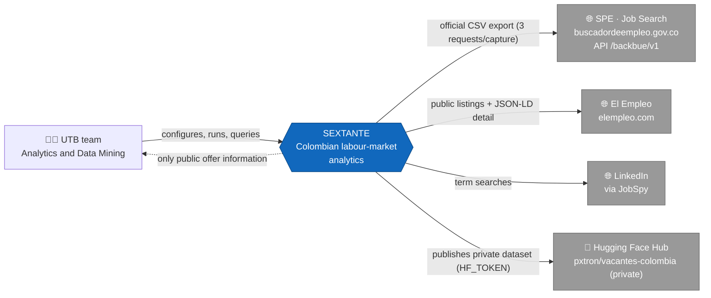
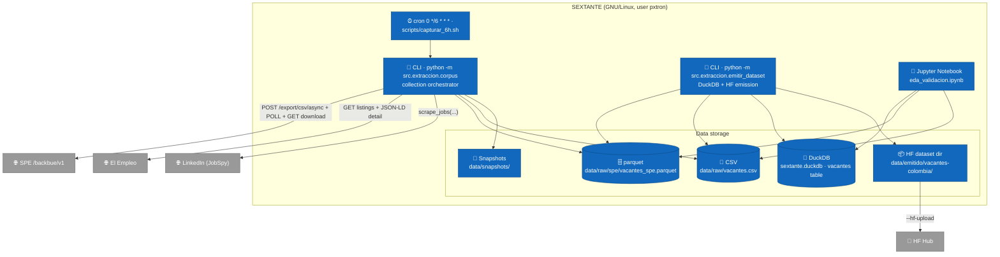
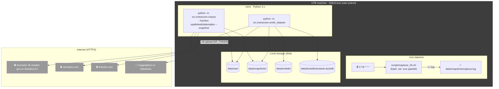
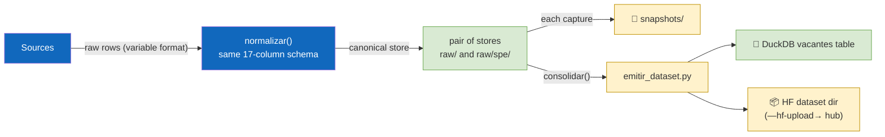
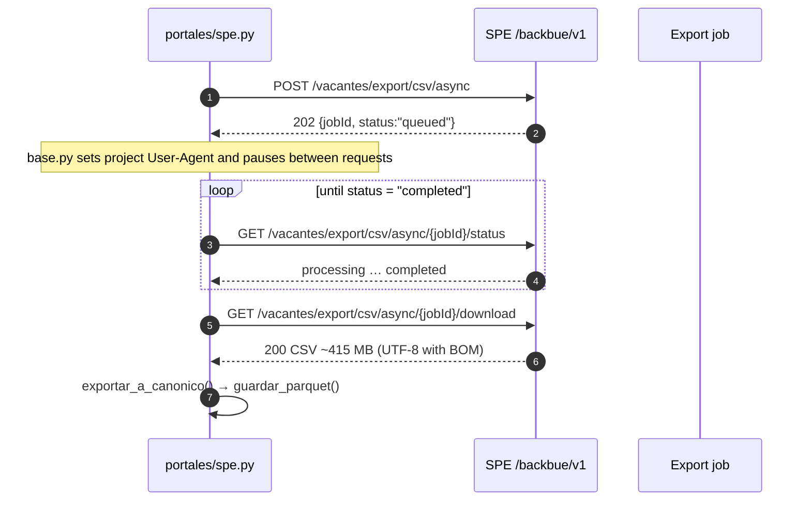
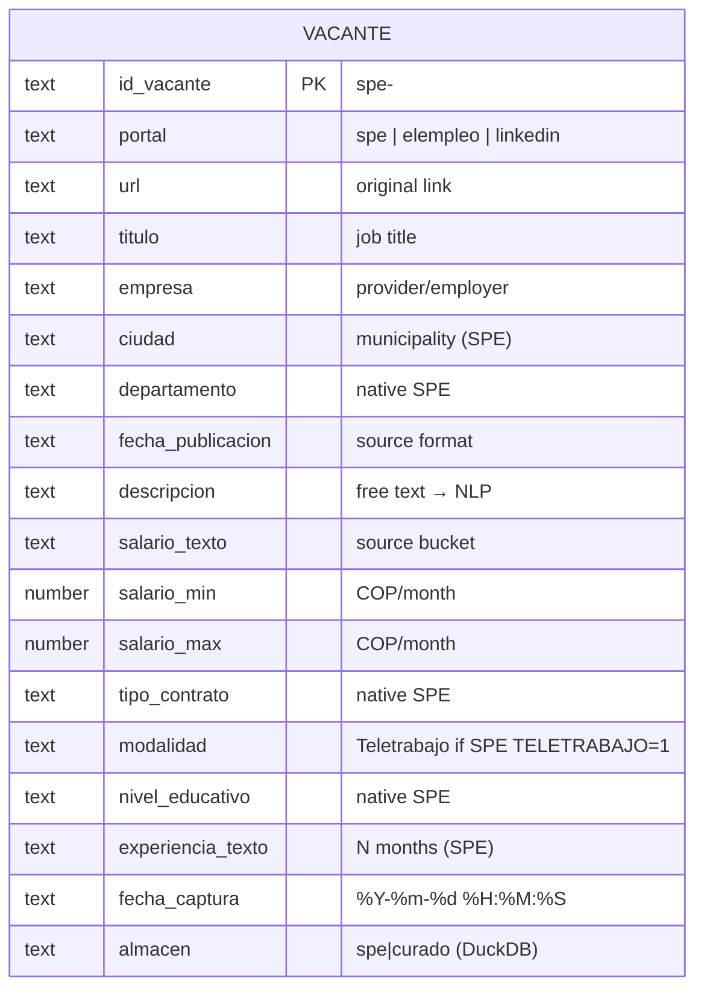

# SEXTANTE Architecture

> **🌐 English** · [Versión en español](arquitectura.md) · [README](../README.en.md)

C4 model of the platform (context, containers, components and deployment), main data flows, capture sequences and data model. All diagrams are written in **Mermaid** so they render in docs, editors and GitHub.

## Contents

1. [Overview](#overview)
2. [C4 model](#c4-model)
   - [Level 1 · Context](#level-1--context)
   - [Level 2 · Containers](#level-2--containers)
   - [Level 3 · Components](#level-3--components)
   - [Level 4 · Deployment](#level-4--deployment)
3. [Data flow and periodic capture](#data-flow-and-periodic-capture)
4. [Sequence: SPE asynchronous export](#sequence-spe-asynchronous-export)
5. [Data model](#data-model)
6. [Design decisions](#design-decisions)

---

## Overview

SEXTANTE is an ETL/ELT pipeline for Colombian job vacancies:

1. **Extracts** from three sources: the official SPE export (massive, ~285k rows/capture), El Empleo (HTML + JSON-LD) and LinkedIn (JobSpy).
2. **Normalises** everything to the **17-column canonical schema** (`src/extraccion/esquema.py`, `normalizar()` / `validar()`).
3. **Stores** into two stores: canonical big corpus in parquet (SPE) and curated corpus in CSV (El Empleo + LinkedIn), with timestamped snapshots.
4. **Emits** the unified dataset to local DuckDB and a Hugging Face-ready directory (`emitir_dataset.py`; optional upload with `--hf-upload`).
5. **Capture is automatic** every 6 hours via cron (`scripts/capturar_6h.sh`).

Current state: **246,782 vacancies** in DuckDB (246,551 SPE + 231 curated), private HF dataset `pxtron/vacantes-colombia`, active cron capture `0 */6 * * *`.

---

## C4 model

### Level 1 · Context

Who uses the system and the external systems it interacts with.



- **UTB team**: configures, runs and queries results (CLI + validation notebook).
- **SPE**: external state system from which the full export is downloaded (official mechanism, no scraping).
- **El Empleo** and **LinkedIn**: portals scraped under ethical criteria (throttling, identifiable UA, robots.txt).
- **Hugging Face Hub**: publishing target for the dataset (private, academic).

### Level 2 · Containers

Decomposition of the system into executable and high-level storage containers.



- **corpus.py**: orchestrates sources, applies `normalizar()`, saves with dedupe and snapshots.
- **emitir_dataset.py**: consolidates both stores and writes DuckDB + HF directory.
- **DuckDB**: local analytics database; `vacantes` table with 17 canonical columns + `almacen` (`spe`/`curado`).
- **Jupyter**: EDA validating schema and coverage.

### Level 3 · Components

Internal components of the extraction/emission container.

```mermaid
flowchart LR
    subgraph SRC["src/extraccion/"]
        schema["esquema.py<br/>17-column contract"]
        base["base.py<br/>ethical HTTP + save/dedupe/snapshots"]
        corpus["corpus.py<br/>CLI orchestrator"]
        emitir["emitir_dataset.py<br/>DuckDB + HF"]

        subgraph PORTALS["portales/"]
            spe["spe.py<br/>official export → parquet"]
            ele["elempleo.py<br/>HTML + JSON-LD"]
            lin["linkedin_jobspy.py<br/>JobSpy → schema"]
        end
    end

    corpus --> spe
    corpus --> ele
    corpus --> lin
    spe -->|normalizar()| schema
    ele -->|normalizar()| schema
    lin -->|normalizar()| schema
    base --> corpus
    base --> emitir
    emitir --> schema

    classDef borde fill:#f3f3f3,stroke:#999;
    classDef mod fill:#1168bd,color:#fff;
    class SRC borde;
    class schema,base,corpus,emitir,spe,ele,lin mod;
```

Key component details:

- **spe.py** — drives the massive export: `descargar_export_csv()` (async job), `_parsear_salario()` (bucket → `salario_min`/`salario_max`), `exportar_a_canonico()` (`id_vacante = spe-<CODIGO_VACANTE>`), `guardar_parquet()` (dedupe by `id_vacante`). Includes retry for the portal's intermittent TLS (`verify=False` only after SSL failure, with a warning).
- **elempleo.py** — public SEO listings + JSON-LD `JobPosting` detail (`baseSalary`, `employmentType`, `jobLocationType`…).
- **linkedin_jobspy.py** — `scrape_jobs(site_name=["linkedin"], location="Colombia", ...)` per term; 10 searches × 25.
- **base.py** — session with `User-Agent: SEXTANTE-UTB-university-research/1.0`, request pauses, `guardar_lotes()` (append + dedupe `url`) and `guardar_snapshot()`.
- **esquema.py** — defines and validates the single output contract.
- **emitir_dataset.py** — `consolidar()` merges SPE+curated and adds `almacen`; highlights: `CREATE OR REPLACE TABLE vacantes` in DuckDB and parquet shards (`FILAS_POR_SHARD=60_000`) + dataset card with provenance and ethics.

### Level 4 · Deployment

How and where it physically runs.



- Cadence: every 6 h the full capture (SPE ~415 MB + curated + emission) is re-captured and accumulated.
- HF upload is not automatic in cron (avoids token friction); it runs on demand with `--hf-upload`.

---

## Data flow and periodic capture

Same logic as the README, emphasising what each step produces:



Snapshot retention: all snapshots are kept (SPE parquet ~107 MB and curated CSV); the design kept the original raw CSV of the first cuts and now **stops copying it** on new captures to save ~415 MB/capture.

---

## Sequence: SPE asynchronous export

SPE does not expose a direct download endpoint: an export job is created and polled until `completed` (the portal's own official mechanism).



Latest export result: **284,958 rows → 246,551 unique** in the store by `id_vacante` (the export includes duplicated rows of the same `CODIGO_VACANTE` dropped by `guardar_parquet()`).

---

## Data model

### Entity–relationship diagram



### Dictionary / coverage

| Column | Native in | SPE coverage | Notes |
| --- | --- | --- | --- |
| `id_vacante` | all | 100% | SPE: `spe-<CODIGO_VACANTE>` |
| `portal` | all | 100% | source label |
| `url` | all | 100% | SPE: `URL_DETALLE_VACANTE` |
| `titulo` | all | 100% | `TITULO_VACANTE` |
| `empresa` | SPE/ElEmpleo | ~100% | `NOMBRE_PRESTADOR` |
| `ciudad` | SPE/ElEmpleo | ~100% | `MUNICIPIO` |
| `departamento` | SPE | ~100% | was 0% before SPE |
| `fecha_publicacion` | all | ~100% | source format |
| `descripcion` | all | 100% | NLP basis |
| `salario_texto` | SPE/ElEmpleo | ~100% | SPE bucket |
| `salario_min`/`salario_max` | SPE | ~78% | derived from bucket |
| `tipo_contrato` | SPE/ElEmpleo | ~100% | SPE contract |
| `modalidad` | all | ~0.8% remote | SPE `TELETRABAJO=1` |
| `nivel_educativo` | SPE | ~100% | was 0% before |
| `experiencia_texto` | SPE | ~100% | `MESES_EXPERIENCIA_CARGO` |
| `fecha_captura` | all | 100% | stamp `%Y-%m-%d %H:%M:%S` |
| `almacen` (DuckDB) | emission | — | `spe`/`curado` |

---

## Design decisions

| Topic | Decision | Reason |
| --- | --- | --- |
| Master source | SPE official export (API `/backbue/v1`) | State data, official mechanism, ~285k offers/capture, ~100% coverage of key fields. |
| Per-source dedupe | SPE by `id_vacante` (CODIGO_VACANTE); curated by `url` | Several distinct SPE vacancies share the provider's `url`; record-level precedence. |
| Schema | Single 17-column canonical schema (`esquema.py`) | Single output contract; `normalizar()` before saving, `validar()` in EDA. |
| Capture cadence | cron `0 */6 * * *` | Balance between data freshness and load on the state portal (12 h and 1 h were also evaluated). |
| SPE snapshots | canonical parquet only (no raw CSV) | Raw CSV is 415 MB; parquet is enough as a reproducible cut. |
| SPE intermittent TLS | `verify=False` **only** after validation failure | Read-only state site; warned via `warnings`. |
| Publishing | **private** HF dataset `pxtron/vacantes-colombia` | Academic use; no public redistribution of third-party portal data. |
| HF upload | manual (`--hf-upload` with `HF_TOKEN`) | Avoid putting the token in cron and re-uploading 108 MB unnecessarily each run. |
| Storage | local DuckDB + parquet on disk | Serverless analytics; parquet is ready for `polars`/`pyarrow`/`spark` if needed. |

Original document is in **[Spanish (arquitectura.md)](arquitectura.md)**; this English version is a translation.