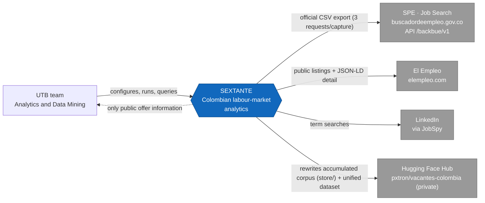
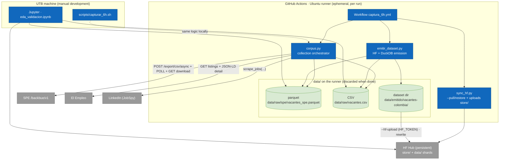
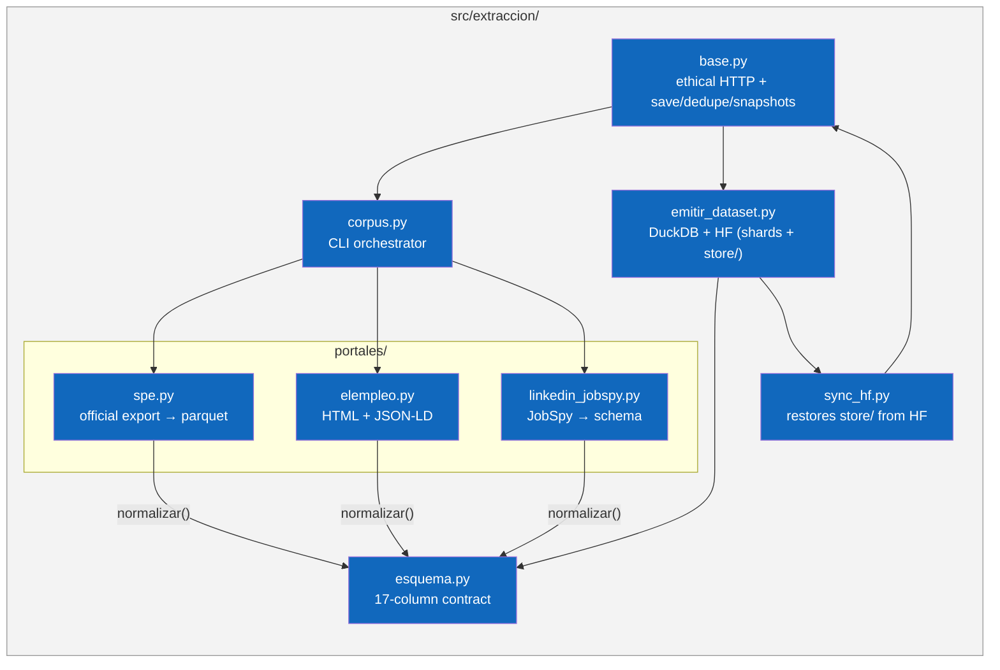
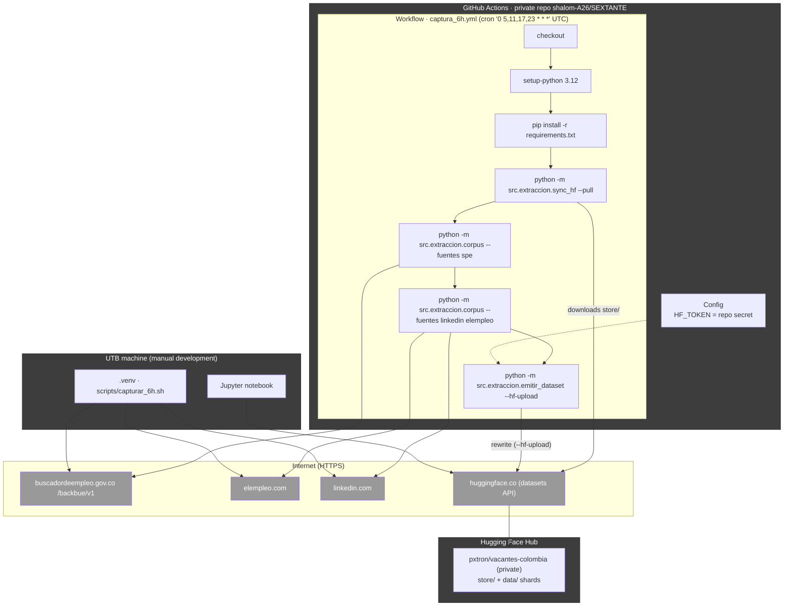
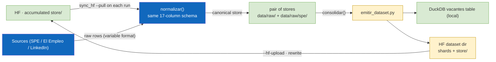
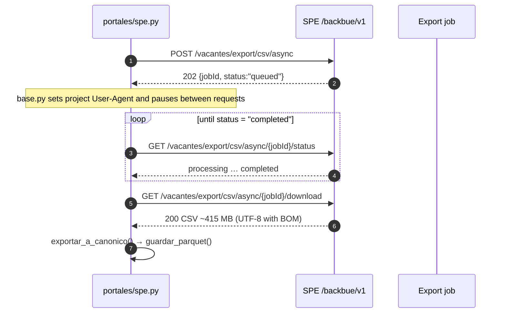
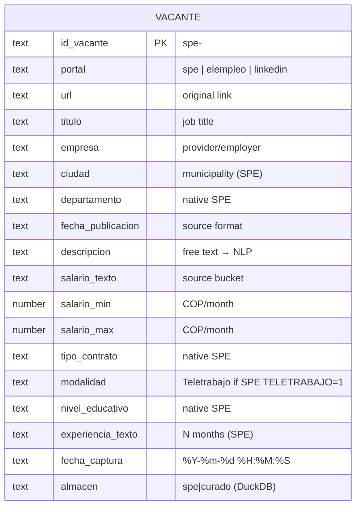

# SEXTANTE Architecture

> [Spanish](arquitectura.md) · [English](architecture.en.md) · [README](../README.en.md)

C4 model of the platform (context, containers, components and deployment), main data flows, capture sequences and data model. All diagrams are written in **Mermaid** so they render in docs, editors and GitHub.

## Contents

1. [Overview](#overview)
2. [C4 model](#c4-model)
   - [Level 1 · Context](#level-1--context)
   - [Level 2 · Containers](#level-2--containers)
   - [Level 3 · Components](#level-3--components)
   - [Level 4 · Deployment](#level-4--deployment)
3. [Data flow and periodic capture](#data-flow-and-periodic-capture)
4. [Sequence: SPE asynchronous export](#sequence-spe-asynchronous-export)
5. [Data model](#data-model)
6. [Design decisions](#design-decisions)

---

## Overview

SEXTANTE is an ETL/ELT pipeline for Colombian job vacancies:

1. **Extracts** from three sources: the official SPE export (massive, ~285k rows/capture), El Empleo (HTML + JSON-LD) and LinkedIn (JobSpy).
2. **Normalises** everything to the **17-column canonical schema** (`src/extraccion/esquema.py`, `normalizar()` / `validar()`).
3. **Stores** into two stores: canonical big corpus in parquet (SPE) and curated corpus in CSV (El Empleo + LinkedIn).
4. **Persistent memory = Hugging Face**: `sync_hf.py` restores the accumulated corpus (`store/`) before each run; `emitir_dataset.py` rewrites it into HF together with the unified dataset (17-column shards).
5. **Capture is automatic every 6 hours** on **GitHub Actions** (`.github/workflows/captura_6h.yml`); the local cron is disabled and `scripts/capturar_6h.sh` remains for manual development use.

Current state: **246,782 vacancies** in local DuckDB (246,551 SPE + 231 curated), private HF dataset `pxtron/vacantes-colombia` (shards + `store/`), active workflow `0 5,11,17,23 * * *` UTC (= 00/06/12/18 Colombia time).

---

## C4 model

### Level 1 · Context

Who uses the system and the external systems it interacts with.

- **UTB team**: configures and runs the workflow (Repo Actions) and queries results (CLI + validation notebook + HF dataset).
- **SPE**: external state system from which the full export is downloaded (official mechanism, no scraping).
- **El Empleo** and **LinkedIn**: portals scraped under ethical criteria (throttling, identifiable UA, robots.txt).
- **Hugging Face Hub**: the pipeline's persistent memory and the dataset publishing target (private, academic).

### Level 2 · Containers

Decomposition of the system into executable and storage containers.

- **corpus.py**: orchestrates sources, applies `normalizar()`, saves with dedupe and, in manual mode, snapshots.
- **sync_hf.py**: the gateway to persistent memory — restores `store/vacantes_spe.parquet` and `store/vacantes_curado.csv` from HF before capturing.
- **emitir_dataset.py**: consolidates both stores, writes DuckDB (local, analytics) and generates the HF directory that is later uploaded with `--hf-upload` (17-column shards **+** `store/`).
- **DuckDB**: local analytics database; `vacantes` table with 17 canonical columns + `almacen` (`spe`/`curado`).
- **Jupyter**: EDA validating schema and coverage.

### Level 3 · Components

Internal components of the extraction/emission container.

Key component details:

- **spe.py** — drives the massive export: `descargar_export_csv()` (async job), `_parsear_salario()` (bucket → `salario_min`/`salario_max`), `exportar_a_canonico()` (`id_vacante = spe-<CODIGO_VACANTE>`), `guardar_parquet()` (dedupe by `id_vacante`). Includes retry for the portal's intermittent TLS (`verify=False` only after SSL failure, with a warning).
- **elempleo.py** — public SEO listings + JSON-LD `JobPosting` detail (`baseSalary`, `employmentType`, `jobLocationType`…).
- **linkedin_jobspy.py** — `scrape_jobs(site_name=["linkedin"], location="Colombia", ...)` per term; typically 10 searches × 25.
- **base.py** — session with `User-Agent: SEXTANTE-UTB-university-research/1.0`, request pauses, `guardar_lotes()` (append + dedupe `url`), `guardar_snapshot()`.
- **esquema.py** — defines and validates the single output contract.
- **sync_hf.py** — downloads `store/` from the HF dataset (dedupe/restore); tolerates a non-existing repo on the very first run.
- **emitir_dataset.py** — `consolidar()` merges SPE+curated and adds `almacen`; `CREATE OR REPLACE TABLE vacantes` in DuckDB, parquet shards (`FILAS_POR_SHARD=60_000`), dataset card with provenance/ethics and **`store/` staging** so HF is the persistent memory.

### Level 4 · Deployment

The capture pipeline runs on GitHub Actions infrastructure (ephemeral Ubuntu runner); the local machine is only for manual development/queries.

- Cadence: every 6 h (Colombia time 00/06/12/18) the runner re-captures the SPE export, appends the curated data, and **rewrites** the accumulated corpus and the unified dataset into HF.
- The runner is ephemeral: all local writes under `data/` are discarded when the job ends; accumulation continuity is guaranteed by `sync_hf --pull` at the start.
- `HF_TOKEN` lives as a repository secret (never in code); the workflow only needs read permission for checkout.
- The local machine (user pxtron) can run `scripts/capturar_6h.sh` for manual development; its local stores are seeds/queries, not the primary memory.

---

## Data flow and periodic capture

A closed loop with HF as persistent memory:

Growth and storage:

- The corpus grows with the **genuinely new** vacancies (dedupe by `CODIGO_VACANTE` for SPE and by `url` for curated); HF is rewritten on the same paths on each run, with no purges.
- HF storage quota (100 GB on the free account) is measured on the repo's current content: fractions of a GB today and headroom for millions of historical rows.
- Snapshots (`data/snapshots/`) and local DuckDB remain as manual development/registry artefacts (the runner keeps no disk).

---

## Sequence: SPE asynchronous export

SPE does not expose a direct download endpoint: an export job is created and polled until `completed` (the portal's own official mechanism).

Latest export result: **284,958 rows → 246,551 unique** in the store by `id_vacante` (the export includes duplicated rows of the same `CODIGO_VACANTE` dropped by `guardar_parquet()`).

---

## Data model

### Entity–relationship diagram

### Dictionary / coverage

| Column | Native in | SPE coverage | Notes |
| --- | --- | --- | --- |
| `id_vacante` | all | 100% | SPE: `spe-<CODIGO_VACANTE>` |
| `portal` | all | 100% | source label |
| `url` | all | 100% | SPE: `URL_DETALLE_VACANTE` |
| `titulo` | all | 100% | `TITULO_VACANTE` |
| `empresa` | SPE/ElEmpleo | ~100% | `NOMBRE_PRESTADOR` |
| `ciudad` | SPE/ElEmpleo | ~100% | `MUNICIPIO` |
| `departamento` | SPE | ~100% | was 0% before SPE |
| `fecha_publicacion` | all | ~100% | source format |
| `descripcion` | all | 100% | NLP basis |
| `salario_texto` | SPE/ElEmpleo | ~100% | SPE bucket |
| `salario_min`/`salario_max` | SPE | ~78% | derived from bucket |
| `tipo_contrato` | SPE/ElEmpleo | ~100% | SPE contract |
| `modalidad` | all | ~0.8% remote | SPE `TELETRABAJO=1` |
| `nivel_educativo` | SPE | ~100% | was 0% before |
| `experiencia_texto` | SPE | ~100% | `MESES_EXPERIENCIA_CARGO` |
| `fecha_captura` | all | 100% | stamp `%Y-%m-%d %H:%M:%S` |
| `almacen` (DuckDB) | emission | — | `spe`/`curado` |

---

## Design decisions

| Topic | Decision | Reason |
| --- | --- | --- |
| Master source | SPE official export (API `/backbue/v1`) | State data, official mechanism, ~285k offers/capture, ~100% coverage of key fields. |
| Per-source dedupe | SPE by `id_vacante` (CODIGO_VACANTE); curated by `url` | Several distinct SPE vacancies share the provider's `url`; record-level precedence. |
| Schema | Single 17-column canonical schema (`esquema.py`) | Single output contract; `normalizar()` before saving, `validar()` in EDA. |
| Capture cadence | workflow `0 5,11,17,23 * * *` UTC (= 00/06/12/18 Colombia) | Balance between data freshness and load on the state portal; 4 daily captures. |
| Persistent memory | HF = canonical store (`store/`) | The runner is ephemeral; `sync_hf --pull` restores the accumulation before capturing and `emitir_dataset` rewrites it afterwards. |
| Corpus retention | accumulation without purges (dedupe by genuinely new vacancy) | Real growth = new vacancies; HF quota is measured on the repo's current content. |
| HF upload | automatic on every run (`--hf-upload`, `HF_TOKEN` as secret) | The corpus must grow by itself; the token lives in the repo secret, not in code. |
| Concurrency | `concurrency: captura-periodica` (cancel-in-progress: false) | Avoids two simultaneous runs writing to HF at once. |
| Local cron | disabled (script kept for manual development) | Automatic operation belongs to GitHub Actions; the UTB machine stays free. |
| Snapshots | only on manual captures (canonical parquet, no raw CSV) | The raw export CSV is ~415 MB; parquet is enough as a reproducible cut. |
| SPE intermittent TLS | `verify=False` **only** after validation failure | Read-only state site; warned via `warnings`. |
| Publishing | **private** HF dataset `pxtron/vacantes-colombia` | Academic use; no public redistribution of third-party portal data. |
| Analytics storage | local DuckDB + parquet | Serverless analytics; parquet is ready for `polars`/`pyarrow`/`spark` if needed. |

Original document is in **[Spanish (arquitectura.md)](arquitectura.md)**; this English version is a translation.