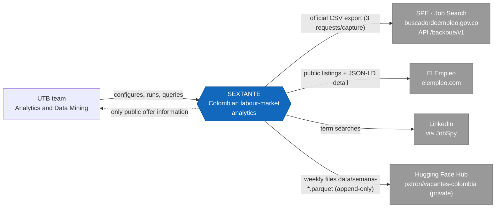
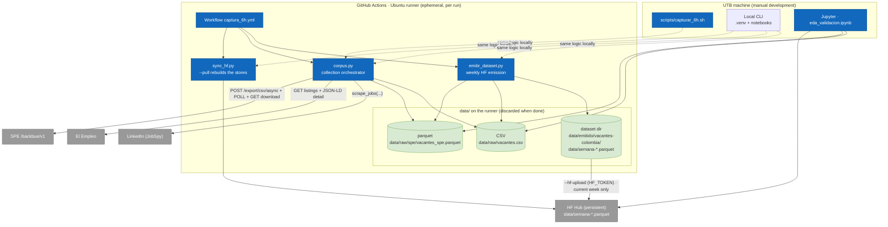
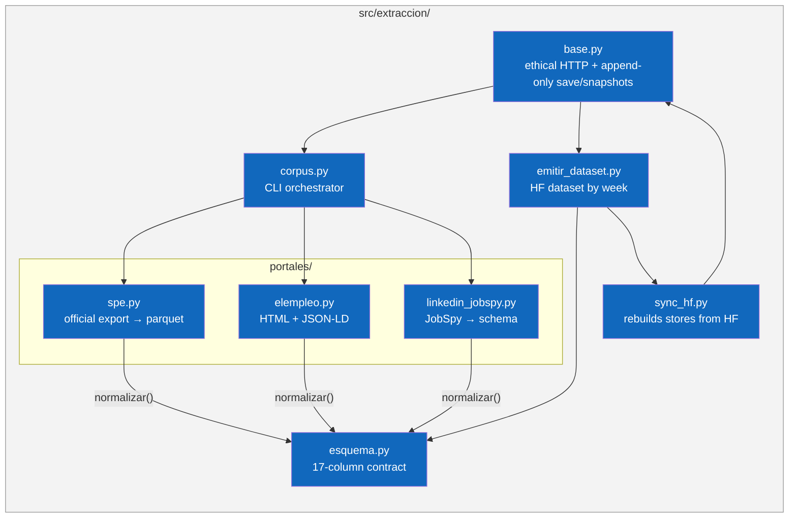
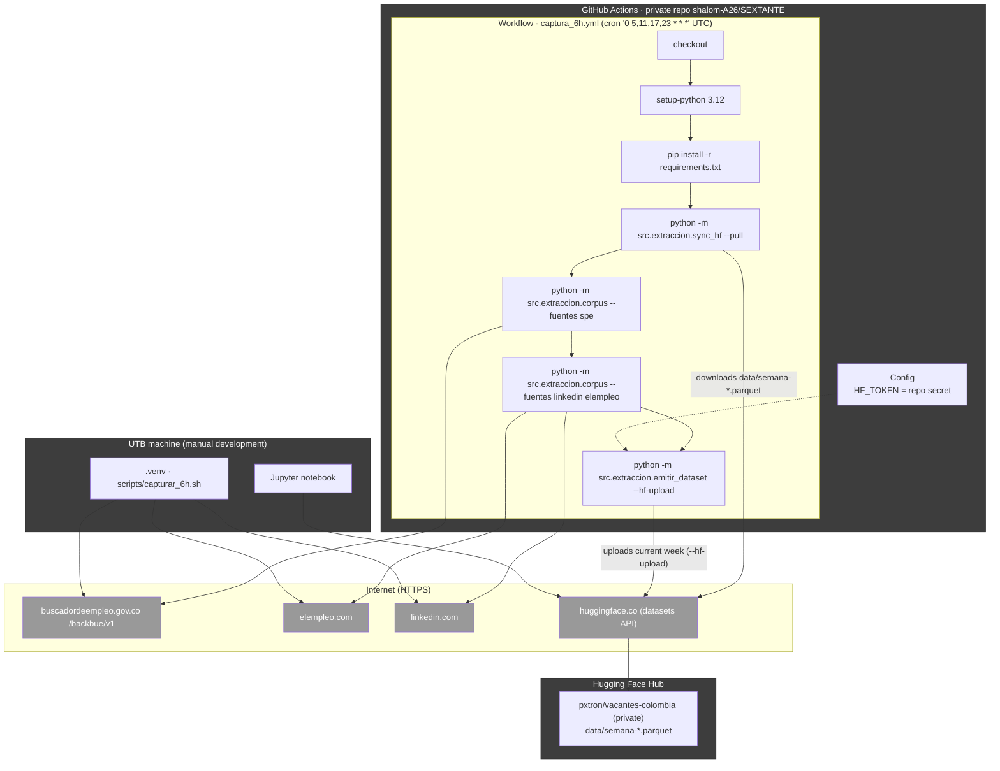
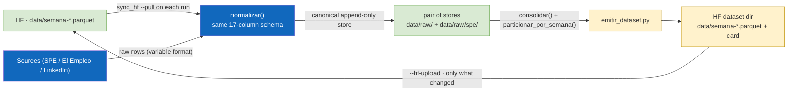
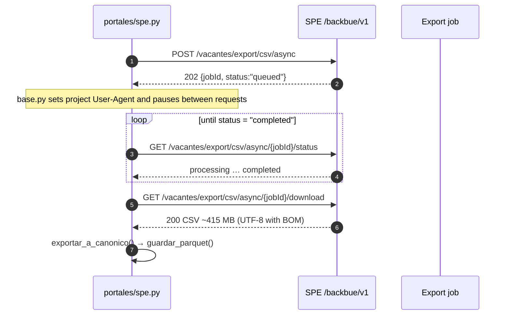
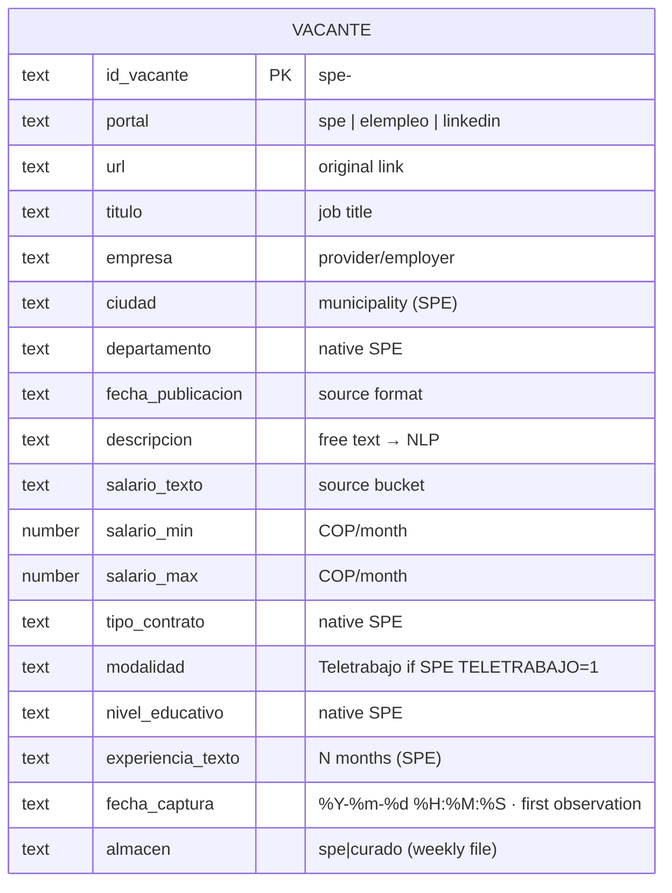
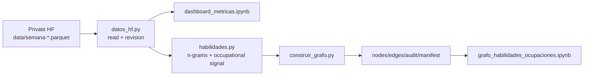

# SEXTANTE Architecture

> [Spanish](arquitectura.md) · [English](architecture.en.md) · [README](../README.en.md)

C4 model of the platform (context, containers, components and deployment), main data flows, capture sequences and data model. All diagrams are written in **Mermaid** so they render in docs, editors and GitHub.

## Contents

1. [Overview](#overview)
2. [C4 model](#c4-model)
   - [Level 1 · Context](#level-1--context)
   - [Level 2 · Containers](#level-2--containers)
   - [Level 3 · Components](#level-3--components)
   - [Level 4 · Deployment](#level-4--deployment)
3. [Data flow and periodic capture](#data-flow-and-periodic-capture)
4. [Sequence: SPE asynchronous export](#sequence-spe-asynchronous-export)
5. [Data model](#data-model)
6. [Design decisions](#design-decisions)

---

## Overview

SEXTANTE is an ETL/ELT pipeline for Colombian job vacancies:

1. **Extracts** from three sources: the official SPE export (massive, ~285k rows/capture), El Empleo (HTML + JSON-LD) and LinkedIn (JobSpy).
2. **Normalises** everything to the **17-column canonical schema** (`src/extraccion/esquema.py`, `normalizar()` / `validar()`).
3. **Stores** into two **append-only** stores: canonical big corpus in parquet (SPE) and curated corpus in CSV (El Empleo + LinkedIn). A vacancy already seen is never rewritten; `fecha_captura` stays pinned to the first observation.
4. **Persistent memory = Hugging Face**: `sync_hf.py` rebuilds the local stores from the published files (`data/semana-*.parquet`) before each run; `emitir_dataset.py` publishes them again.
5. **Capture is automatic every 6 hours** on **GitHub Actions** (`.github/workflows/captura_6h.yml`); the local cron is disabled and `scripts/capturar_6h.sh` remains for manual development use.

Current state: **322,313 vacancies** (319,765 SPE + 2,548 curated) in the private HF dataset `pxtron/vacantes-colombia`, published as weekly parquet files; active workflow `0 5,11,17,23 * * *` UTC (= 00/06/12/18 Colombia time). There is no local database: the analytics layer reads from HF.

**Why weekly.** The previous layout published the corpus twice (`store/` folder plus `train-*-of-*` shards) and never deleted the shards of previous generations: 650 MB of content with 283 MB dead (44 %) and ~1.32 GB of upload per day. With the weekly layout, each vacancy lives in the file for the week it was first seen; because rows are frozen, files for closed weeks are **immutable** and `upload_folder` skips them (their content is already in the repo). Each run uploads only the current week's file: **~14 MB per run on average**, **~58 MB/day** against the previous layout's ~1.32 GB/day (~23× less). The migration executed on 2026-10-04 left the repo at **166 MB of content** (650 MB before) with the same 322,313 vacancies. `used_storage` (~19 GB, mostly history HF does not release) does not shrink when files are deleted: what stops is the growth.

Week W40 is the transitional exception: it holds the legacy backfill (277,864 of the 322,313 rows fall into it, because earlier rows inherit `fecha_captura` from their last observation), so its file weighs 143 MB and every run until Monday the 5th rewrites it whole. From W41 on, the current week's file starts empty and the cost returns to ~14 MB per run.

---

## C4 model

### Level 1 · Context

Who uses the system and the external systems it interacts with.

- **UTB team**: configures and runs the workflow (Repo Actions) and queries results (CLI + validation notebook + HF dataset).
- **SPE**: external state system from which the full export is downloaded (official mechanism, no scraping).
- **El Empleo** and **LinkedIn**: portals scraped under ethical criteria (throttling, identifiable UA, robots.txt).
- **Hugging Face Hub**: the pipeline's persistent memory and the dataset publishing target (private, academic).

### Level 2 · Containers

Decomposition of the system into executable and storage containers.

- **corpus.py**: orchestrates sources, applies `normalizar()`, saves with append-only dedupe and, in manual mode, snapshots. Exits with code 1 if a requested source fails.
- **sync_hf.py**: the gateway to persistent memory — rebuilds `data/raw/spe/vacantes_spe.parquet` and `data/raw/vacantes.csv` from the published `data/semana-*.parquet` (with a fallback to the `store/` layout for datasets not yet migrated) and leaves `data/raw/_publicado.json` with the previous run's counts.
- **emitir_dataset.py**: consolidates both stores, groups them by `fecha_captura` week and generates the HF directory (`data/semana-*.parquet` + dataset card + `estado.json`), which `--hf-upload` publishes skipping what is already in the repo.
- **Hugging Face as the only analytics storage**: there is no local database. `src/analisis/datos_hf.py` reads the parquet files read-only and records the resolved revision.
- **Jupyter**: EDA validating schema and coverage.

### Level 3 · Components

Internal components of the extraction/emission container.

Key component details:

- **spe.py** — drives the massive export: `descargar_export_csv()` (async job), `_parsear_salario()` (bucket → `salario_min`/`salario_max`), `exportar_a_canonico()` (`id_vacante = spe-<CODIGO_VACANTE>`), `guardar_parquet()` (append-only by `id_vacante`, `keep="first"`, returns how many rows are new). Includes retry for the portal's intermittent TLS (`verify=False` only after SSL failure, with a warning).
- **elempleo.py** — public SEO listings + JSON-LD `JobPosting` detail (`baseSalary`, `employmentType`, `jobLocationType`…).
- **linkedin_jobspy.py** — `scrape_jobs(site_name=["linkedin"], location="Colombia", ...)` per term; typically 10 searches × 25.
- **base.py** — session with `User-Agent: SEXTANTE-UTB-university-research/1.0`, request pauses, `guardar_lotes()` (append + dedupe `url`, never rewriting what was already seen), `guardar_snapshot()`.
- **esquema.py** — defines and validates the single output contract.
- **sync_hf.py** — `restaurar_stores()` splits what was published between the two stores by `almacen`; `descargar_estado()` picks the weekly layout or, if the repo has no weekly files yet, the inherited `store/`. It writes `data/raw/_publicado.json` so the emission can measure real growth.
- **emitir_dataset.py** — `consolidar()` merges SPE+curated and adds `almacen`; `particionar_por_semana()` groups by `fecha_captura`; `_salida_estable()` fixes dtypes and row order so identical content yields identical bytes (and `upload_folder` skips the file); it generates the dataset card, `estado.json` and, on `--hf-upload`, migrates the previous layout **only if the corpus is known to have been restored**.

### Level 4 · Deployment

The capture pipeline runs on GitHub Actions infrastructure (ephemeral Ubuntu runner); the local machine is only for manual development/queries.

- Cadence: every 6 h (Colombia time 00/06/12/18) the runner re-captures the SPE export, appends the curated data and **republishes** the dataset into HF. The nominal cron is not honoured to the minute: measured across 20 runs in September–October 2026, deviations range from −3.4 h to +2.6 h with one ~8.8 h blind window. The average stays at ~4 captures per day, but not at the documented hours.
- The runner is ephemeral: all local writes under `data/` are discarded when the job ends; accumulation continuity is guaranteed by `sync_hf --pull` at the start.
- `HF_TOKEN` lives as a repository secret (never in code); the workflow only needs read permission for checkout.
- The local machine (user pxtron) can run `scripts/capturar_6h.sh` for manual development; its local stores are seeds/queries, not the primary memory.

---

## Data flow and periodic capture

A closed loop with HF as persistent memory:

Growth and storage:

- The corpus grows with the **genuinely new** vacancies (dedupe by `CODIGO_VACANTE` for SPE and by `url` for curated); no purges.
- Growth on HF is bounded by the immutability of closed weeks: each vacancy is uploaded **once**, and only the current week's file is rewritten on each run.
- Cost: ~35 k new vacancies/week ≈ 3.3 MB of new data per day, but the upload is paid on the whole current week's file (~14 MB average per run, ~58 MB/day) against ~1.32 GB/day in the previous layout (~23× less). The already-accumulated history (18.5 GB) does not shrink — HF does not release it — but it stops growing.
- `data/raw/_publicado.json` holds the previous run's counts, which lets the workflow Summary tell "it grew" apart from "it contributed nothing" — the signal that exposes a dead source.
- Snapshots (`data/snapshots/`) remain as manual development/registry artefacts (the runner keeps no disk).

---

## Sequence: SPE asynchronous export

SPE does not expose a direct download endpoint: an export job is created and polled until `completed` (the portal's own official mechanism).

Export result observed on 2026-10-04: **~285 k rows → 319,765 unique** rows accumulated in the store by `id_vacante` (the export includes duplicated rows of the same `CODIGO_VACANTE` dropped by `guardar_parquet()`).

---

## Data model

### Entity–relationship diagram

### Dictionary / coverage

| Column | Native in | SPE coverage | Notes |
| --- | --- | --- | --- |
| `id_vacante` | all | 100% | SPE: `spe-<CODIGO_VACANTE>` |
| `portal` | all | 100% | source label |
| `url` | all | 100% | SPE: `URL_DETALLE_VACANTE` |
| `titulo` | all | 100% | `TITULO_VACANTE` |
| `empresa` | SPE/ElEmpleo | ~100% | `NOMBRE_PRESTADOR` |
| `ciudad` | SPE/ElEmpleo | ~100% | `MUNICIPIO` |
| `departamento` | SPE | ~100% | was 0% before SPE |
| `fecha_publicacion` | all | ~100% | source format |
| `descripcion` | all | 100% | NLP basis |
| `salario_texto` | SPE/ElEmpleo | ~100% | SPE bucket |
| `salario_min`/`salario_max` | SPE | ~78% | derived from bucket |
| `tipo_contrato` | SPE/ElEmpleo | ~100% | SPE contract |
| `modalidad` | all | ~0.8% remote | SPE `TELETRABAJO=1` |
| `nivel_educativo` | SPE | ~100% | was 0% before |
| `experiencia_texto` | SPE | ~100% | `MESES_EXPERIENCIA_CARGO` |
| `fecha_captura` | all | 100% | stamp `%Y-%m-%d %H:%M:%S`; because stores are append-only it is the **first** time we saw the vacancy |
| `almacen` | emission | — | `spe`/`curado`; decides which local store each row returns to on `--pull` |

---

## Design decisions

| Topic | Decision | Reason |
| --- | --- | --- |
| Master source | SPE official export (API `/backbue/v1`) | State data, official mechanism, ~285k offers/capture, ~100% coverage of key fields. |
| Per-source dedupe | SPE by `id_vacante` (CODIGO_VACANTE); curated by `url` | Several distinct SPE vacancies share the provider's `url`; record-level precedence. |
| Store semantics | **append-only** (`keep="first"`): what was already seen is never rewritten | Pins `fecha_captura` to the first observation (making vacancy lifetime measurable), makes the store byte-reproducible, and is the precondition for immutable weekly files. Without it, an edited vacancy would force rewriting its week's file. |
| Schema | Single 17-column canonical schema (`esquema.py`) | Single output contract; `normalizar()` before saving, `validar()` in EDA. |
| Dataset partition | by **`fecha_captura` week**, not `fecha_publicacion` | Archiving a March vacancy when the export delivers it in October would force reopening and rewriting an already-published file. With `fecha_captura`, each file is written once. |
| Stable writes | dtypes and row order pinned in `_salida_estable()` | Identical content → identical bytes → `upload_folder` skips the file. Without it, the ~23× saving is lost to formatting noise. |
| Capture cadence | workflow `0 5,11,17,23 * * *` UTC (= 00/06/12/18 Colombia) | Balance between data freshness and load on the state portal; 4 daily captures (the scheduler does not honour the minute). |
| Persistent memory | HF = canonical store (`data/semana-*.parquet`) | The runner is ephemeral; `sync_hf --pull` rebuilds the stores from what was published before capturing, and `emitir_dataset` republishes afterwards. |
| Corpus retention | accumulation without purges (dedupe by genuinely new vacancy) | Real growth = new vacancies; with immutable weeks, uploading no longer costs the size of the corpus. |
| Visible failures | `corpus.py` exits with code 1 if a source fails; `estado.json` + Summary compare against what was published | Previously the store restored from HF made everything look healthy while the corpus stopped growing. |
| Layout migration | `store/` and `train-*` are deleted only if the corpus is known to have been restored (rows ≥ published) | A failed `--pull` would publish a tiny dataset; deleting the history is irreversible from code (recoverable only from HF's history). |
| HF upload | automatic on every run (`--hf-upload`, `HF_TOKEN` as secret) | The corpus must grow by itself; the token lives in the repo secret, not in code. |
| Concurrency | `concurrency: captura-periodica` (cancel-in-progress: false) | Avoids two simultaneous runs writing to HF at once. |
| Local cron | disabled (script kept for manual development) | Automatic operation belongs to GitHub Actions; the UTB machine stays free. |
| Snapshots | only on manual captures (canonical parquet, no raw CSV) | The raw export CSV is ~415 MB; parquet is enough as a reproducible cut. |
| SPE intermittent TLS | `verify=False` **only** after validation failure | Read-only state site; warned via `warnings`. |
| Publishing | **private** HF dataset `pxtron/vacantes-colombia` | Academic use; no public redistribution of third-party portal data. |
| Analytics storage | HF only (weekly parquet) | DuckDB was removed: it had been write-only since `898a7e3` and produced a ~200 MB binary under `data/duckdb/` that was not in `.gitignore`. `pyarrow`/`polars` read the parquet files serverlessly. |

Original document is in **[Spanish (arquitectura.md)](arquitectura.md)**; this English version is a translation.

---

## Analytics and job-title–skill graph layer

Analytics reads the private `pxtron/vacantes-colombia` `data/semana-*.parquet`
files.
`src/analisis/datos_hf.py` uses the Hugging Face cache and records the resolved
Analytics reads the private `pxtron/vacantes-colombia` `data/semana-*.parquet`
files. `src/analisis/datos_hf.py` uses the Hugging Face cache and records the
resolved commit; it neither invokes collectors nor changes stores. Since each
vacancy lives in a single file and rows are frozen, deduplication by
`id_vacante` is only a safety net.

`src/procesamiento/habilidades.py` extracts **endogenous vocabulary**: n-grams
from the descriptions themselves, filtered by frequency and an occupational
signal (Aho-Corasick), with no dependency on an external taxonomy.
`src/grafos/construir_grafo.py` emits nodes, edges, audit data, and a provenance
manifest. `metricas_grafo.py` provides TF-IDF cosine similarity, communities,
and exploratory proximity signals.

The current volume does not justify Spark. It remains an option for millions
of texts or distributed NLP/embedding inference.

**Current findings (2026-10-04).** Occupational mapping is the bottleneck:
195,175 normalised job titles of which 157,172 appear only once, and with
`minimo_ocupacion=5` only 6,763 occupations remain over 90,015 vacancies. Node
degree does not help prioritise skills — its top terms are contractual
conditions — while ranking by occupational signal does yield legible terms. The
network is connected (1 component).
