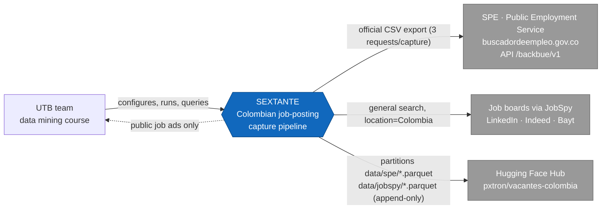
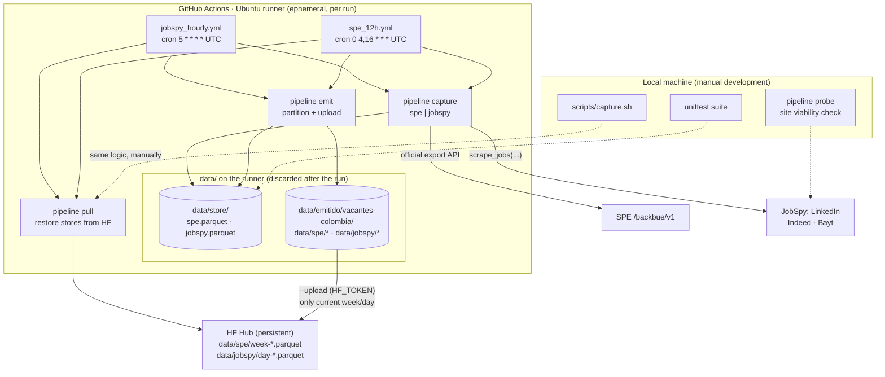
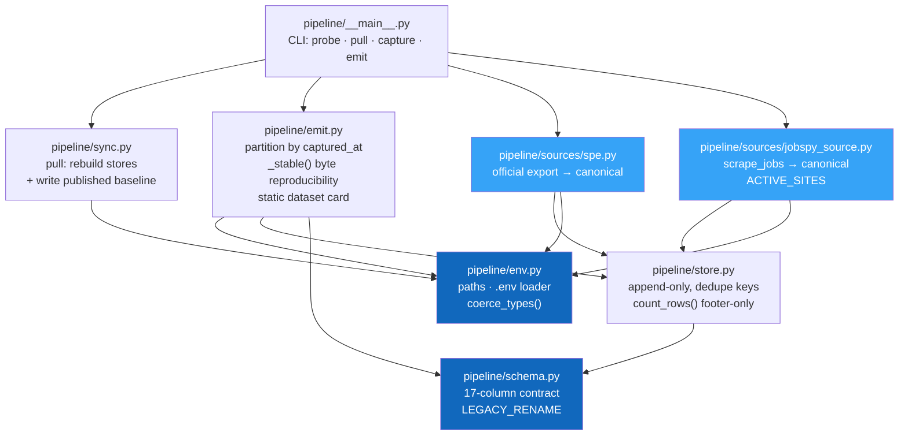
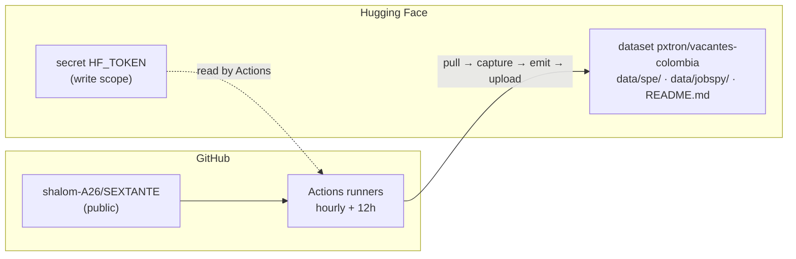
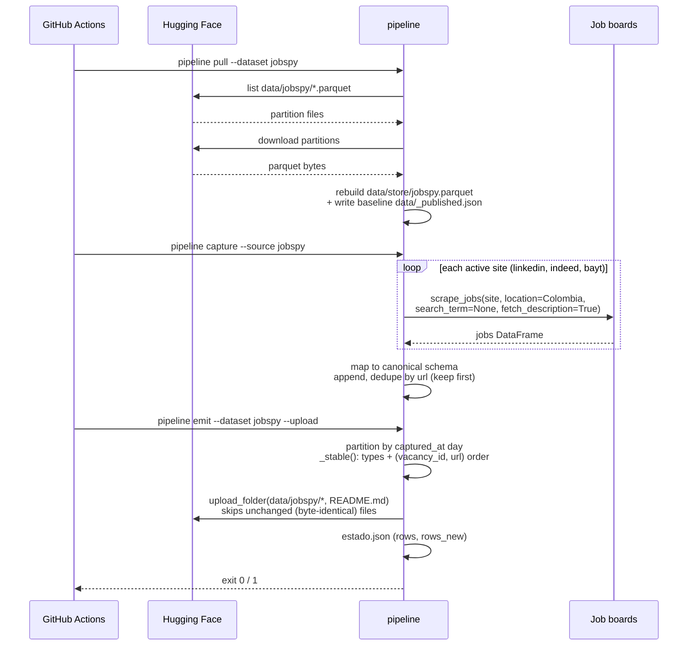
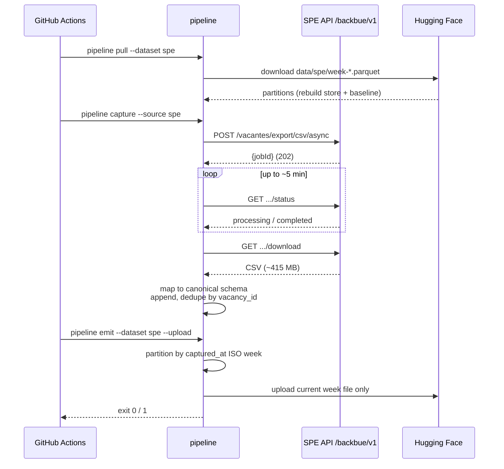

# SEXTANTE architecture

> [README](../README.md) · [Source viability](source-viability.md)

C4 model of the pipeline (context, containers, components, deployment), main
data flows, capture sequences and data model. All diagrams are **Mermaid** so
they render in docs, editors and GitHub.

## Contents

1. [Summary](#summary)
2. [C4 model](#c4-model)
   - [Level 1 · Context](#level-1--context)
   - [Level 2 · Containers](#level-2--containers)
   - [Level 3 · Components](#level-3--components)
   - [Level 4 · Deployment](#level-4--deployment)
3. [Data flow and scheduled capture](#data-flow-and-scheduled-capture)
4. [Sequence: hourly JobSpy capture](#sequence-hourly-jobspy-capture)
5. [Sequence: SPE export](#sequence-spe-export)
6. [Data model](#data-model)
7. [Design decisions](#design-decisions)

---

## Summary

SEXTANTE is an ELT pipeline of Colombian job postings:

1. **Extract** from two source groups: the official SPE export (massive,
   ~285k rows/capture) and JobSpy job boards (LinkedIn, Indeed, Bayt) with a
   general search for Colombia.
2. **Normalize** everything to the **canonical 17-column schema**
   (`pipeline/schema.py`, `normalize()` / `validate()`).
3. **Save** in two **append-only local stores** (`data/store/spe.parquet`,
   `data/store/jobspy.parquet`). A vacancy already seen is never rewritten;
   `captured_at` stays fixed at the first observation.
4. **Persistent memory = Hugging Face**: `python -m pipeline pull` recomposes the
   local stores from the published partitions before each run;
   `pipeline emit` publishes them back. The runner is ephemeral, so without
   this step there is no accumulation.
5. **Capture is automated**: hourly for JobSpy
   (`.github/workflows/jobspy_hourly.yml`, cron `5 * * * *` UTC) and every
   12 hours for SPE (`.github/workflows/spe_12h.yml`, cron `0 4,16 * * *`
   UTC). Both share the `hf-upload` concurrency group. There is no local
   cron; `scripts/capture.sh` is the manual development entry point.

**Why two partition grains.** The SPE export is a full snapshot of a portal
that changes slowly: weekly files keep the number of published files low and
each closed week is immutable. JobSpy runs hourly and surfaces new postings
the same day: daily files give an analysis-friendly time series (one row per
capture day) without creating 24 files per day that the same run keeps
rewriting. In both cases only the *current* file changes between runs.

**Upload economics.** Rows are frozen (`keep="first"`), so closed files
never change; `emit._stable()` guarantees identical content produces
identical bytes, and `upload_folder` skips files already present upstream.
Publishing stays cheap no matter how often the cron fires.

---

## C4 model

### Level 1 · Context

Who uses the system and which external systems it talks to.



- **UTB team**: configures and runs the workflows (GitHub Actions) and
  queries the dataset (CLI + Hugging Face).
- **SPE**: state system offering a mass export (official mechanism, no
  scraping).
- **Job boards**: scraped through JobSpy with ethical criteria
  (identifiable User-Agent, throttling, robots.txt; viability per site in
  [source-viability.md](source-viability.md)).
- **Hugging Face Hub**: persistent memory of the pipeline and destination of
  the published dataset.

### Level 2 · Containers

Decomposition into executable containers and data stores.



### Level 3 · Components

Inside the `pipeline` package.



| Component | Responsibility | Depends on |
|---|---|---|
| `schema` | Canonical columns, `normalize()`, legacy rename map | — |
| `env` | Paths, `.env` loading, stable type coercion | `schema` |
| `store` | Append-only dedupe per dataset, footer-only counts | `env`, `schema` |
| `sync` | Rebuild stores from HF, published baseline | `env` |
| `emit` | Partition, stabilize bytes, card, upload | `env`, `store` |
| `sources.spe` | Official export → canonical | `store`, `env` |
| `sources.jobspy_source` | JobSpy → canonical, active sites | `store`, `env` |
| `__main__` | CLI wiring | everything |

### Level 4 · Deployment



The local machine is optional: it runs the same CLI manually
(`scripts/capture.sh`) and the test suite. No service is permanently deployed.

---

## Data flow and scheduled capture

```mermaid
flowchart TB
    start(["cron fires"]) --> pull["pipeline pull<br/>restore store(s) from HF<br/>write data/_published.json baseline"]
    pull --> which{"which workflow?"}

    which -->|"hourly"| js["capture --source jobspy<br/>general search per active site<br/>→ append, dedupe by url"]
    which -->|"12h"| sp["capture --source spe<br/>official CSV export → append,<br/>dedupe by vacancy_id"]

    js --> emitj["emit --dataset jobspy<br/>data/jobspy/day-YYYY-MM-DD.parquet"]
    sp --> emits["emit --dataset spe<br/>data/spe/week-YYYY-Www.parquet"]

    emitj --> up["upload: current day file<br/>+ static card; closed files skipped"]
    emits --> up

    up --> estado["estado.json: rows,<br/>rows_new, latest_capture"]
    estado --> summary["Actions run summary<br/>warns on zero growth"]
    summary --> end(["done"])

    classDef warn fill:#d9534f,color:#fff;
    class summary warn;
```

Failure behavior:

- `pipeline capture` exits with code 1 if a source fails (a restored store
  would otherwise make the run *look* healthy while the corpus stopped
  growing).
- `pipeline emit` refuses to run when the store is missing (emitting an
  empty store would publish an empty dataset).
- `rows_new` is `null` when there was no pull baseline — growth is never
  invented from the total.

---

## Sequence: hourly JobSpy capture



## Sequence: SPE export



---

## Data model

### Canonical schema (17 columns)

| # | Column | Type | Meaning |
|---|---|---|---|
| 1 | `vacancy_id` | text | Primary key: `spe-<CODIGO_VACANTE>` / id from the job URL |
| 2 | `source` | text | Origin: `spe`, `linkedin`, `indeed`, `bayt`, ... |
| 3 | `url` | text | Posting URL (dedupe key for jobspy) |
| 4 | `title` | text | Job title |
| 5 | `company` | text | Employer |
| 6 | `city` | text | City (parsed from the source location) |
| 7 | `department` | text | Department, when the source provides it |
| 8 | `published_at` | text | Publication date as given by the source |
| 9 | `description` | text | Full description, when available |
| 10 | `salary_text` | text | Salary as written (band or range) |
| 11 | `salary_min` | float | Numeric lower bound (COP), when parseable |
| 12 | `salary_max` | float | Numeric upper bound (COP), when parseable |
| 13 | `contract_type` | text | Contract type |
| 14 | `work_modality` | text | `Teletrabajo` / `Remoto`, when flagged |
| 15 | `education_level` | text | Required education, when provided |
| 16 | `experience_text` | text | Experience requirement as text |
| 17 | `captured_at` | text | **First** capture timestamp (`%Y-%m-%d %H:%M:%S`) |

Column names are English (renamed on 2026-10-05 from the original Spanish
schema); values stay in Spanish. Unavailable fields are null.

### Published layout (Hugging Face)

```
data/
├── spe/
│   ├── week-2026-W38.parquet    # rows first captured in ISO week 38
│   ├── week-2026-W41.parquet    # current week (the only file that changes)
│   └── undated.parquet          # rows without a parseable captured_at
└── jobspy/
    ├── day-2026-10-04.parquet   # closed day: immutable
    ├── day-2026-10-05.parquet   # current day (rewritten hourly)
    └── undated.parquet
```

Plus a static `README.md` (dataset card; identical bytes every run, uploaded
once) and, locally only, `estado.json` (run state, never uploaded).

### Invariants

- **Partition by capture date**: each row lives in the file of the week/day
  it was *first* seen; the row is frozen, so closed files are immutable.
- **Dedupe keys**: `vacancy_id` (spe) / `url` (jobspy).
- **Byte stability**: `_stable()` fixes dtypes and orders rows by
  `(vacancy_id, url)`; same content ⇒ same bytes ⇒ `upload_folder` skips.
- **Baseline**: `data/_published.json` (written by `pull`) is what lets
  `estado.json` report genuinely new rows.

---

## Design decisions

| Decision | Alternative rejected | Why |
|---|---|---|
| Two datasets (`spe/`, `jobspy/`) | Single mixed folder | Different cadence and grain; lets each workflow publish independently without touching the other's files |
| Weekly files for SPE, daily for JobSpy | Hourly files | A run's new rows are tens, not thousands; hourly files would multiply file count for no analytical gain. SPE changes little in 24h |
| Partition by `captured_at` | Partition by `published_at` | Late-arriving historical rows (SPE back to 2021) would force rewriting already-published files |
| Append-only (`keep="first"`) | Upsert latest version | Freezes rows ⇒ immutable closed files ⇒ cheap uploads; `captured_at` keeps its "first seen" meaning |
| HF as the only memory | Local database / CI cache | Runners are ephemeral; HF gives a single durable, queryable source of truth |
| Pull before capture, hard-fail on error | Best-effort pull | Without it a fresh runner would publish an incomplete corpus over a healthy one |
| Static dataset card | Card with live counts | Counts change every run ⇒ bytes change ⇒ re-upload every run. Counts live in `estado.json` instead |
| Footer-only row counts (`count_rows`) | `pd.read_parquet` | Arrow #34314 race: thread-pooled reader alive at shutdown aborts the process with exit 134 |
| One 12h SPE workflow | Hourly SPE capture | ~415 MB export per run, slow-changing portal; 2 runs/day is enough and kinder to a state service |
