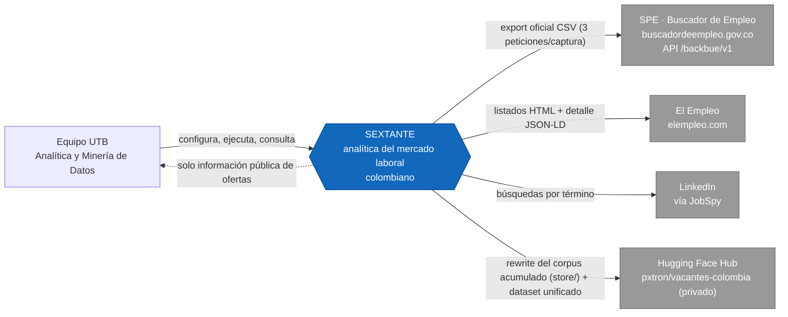
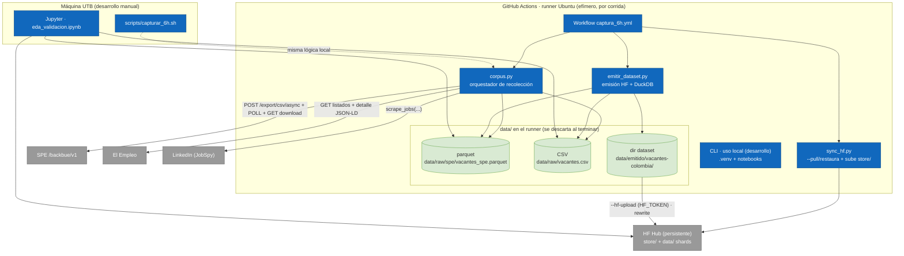
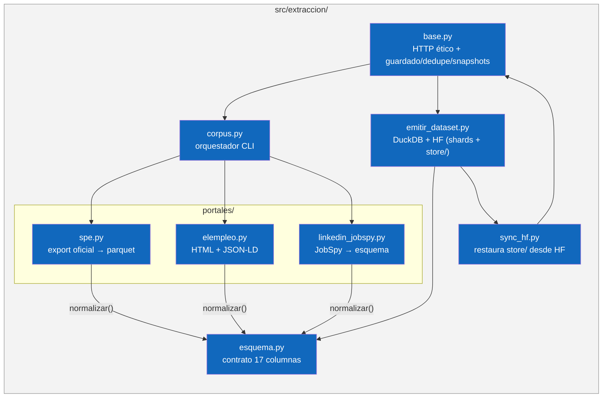
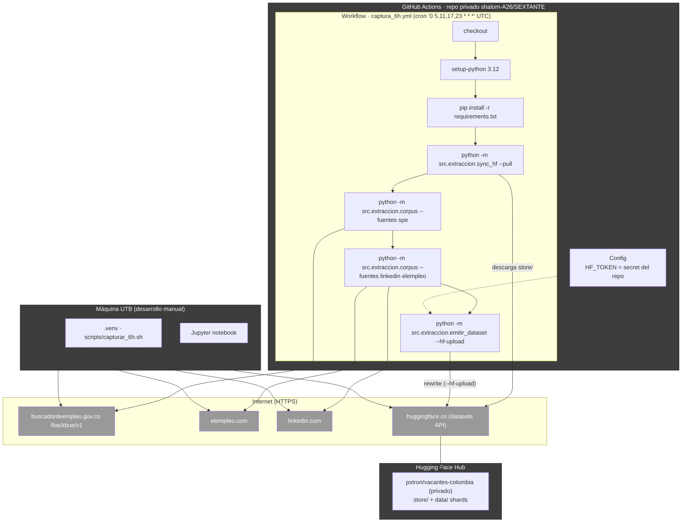
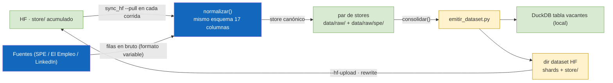
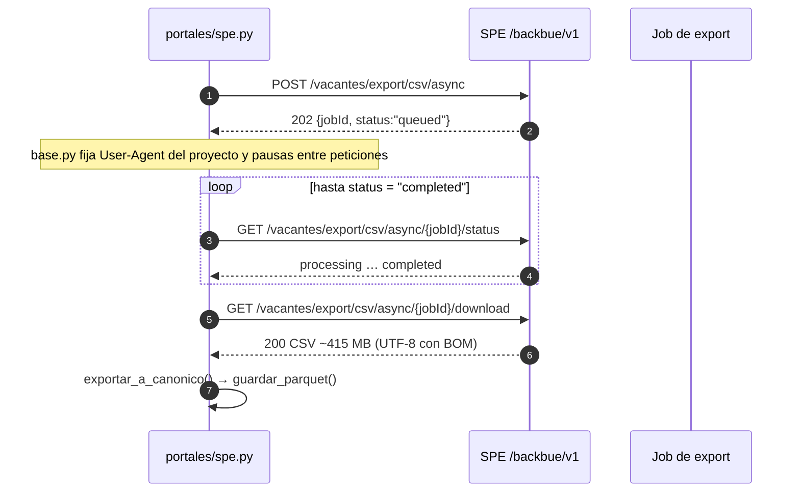
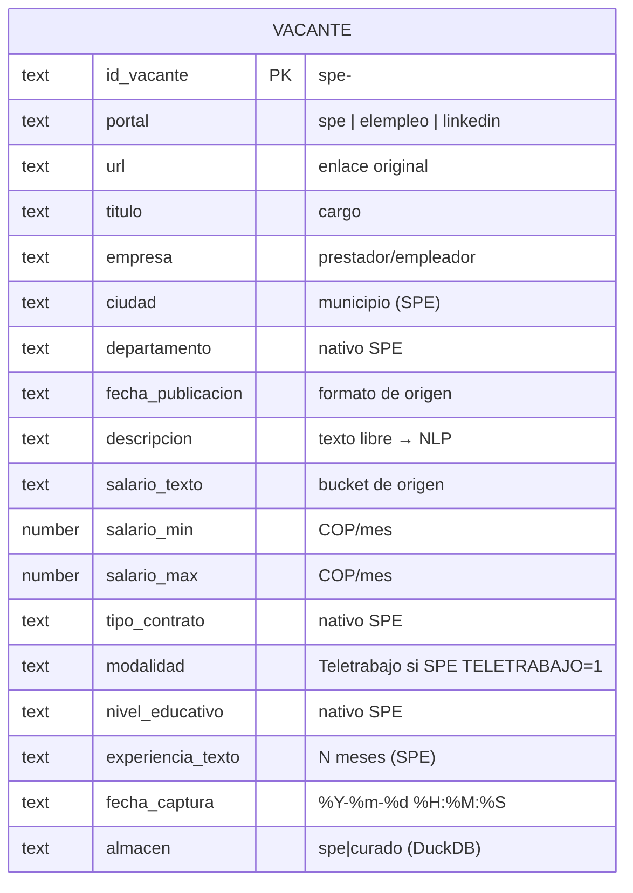

# Arquitectura de SEXTANTE

> [Español](arquitectura.md) · [English version](architecture.en.md) · [README](../README.md)

Modelo C4 de la plataforma (contexto, contenedores, componentes y despliegue), flujos principales de datos, secuencias de captura y modelo de datos. Todos los diagramas están escritos en **Mermaid** para poder renderizarse en docs, editores y GitHub.

## Índice

1. [Resumen](#resumen)
2. [Modelo C4](#modelo-c4)
   - [Nivel 1 · Contexto](#nivel-1--contexto)
   - [Nivel 2 · Contenedores](#nivel-2--contenedores)
   - [Nivel 3 · Componentes](#nivel-3--componentes)
   - [Nivel 4 · Despliegue](#nivel-4--despliegue)
3. [Flujo de datos y captura periódica](#flujo-de-datos-y-captura-periódica)
4. [Secuencia: export asíncrono del SPE](#secuencia-export-asíncrono-del-spe)
5. [Modelo de datos](#modelo-de-datos)
6. [Decisiones de diseño](#decisiones-de-diseño)

---

## Resumen

SEXTANTE es un pipeline ETL/ELT de vacantes laborales colombianas:

1. **Extrae** de tres fuentes: el export oficial del SPE (masivo, ~285 k filas/captura), El Empleo (HTML + JSON-LD) y LinkedIn (JobSpy).
2. **Normaliza** todo al **esquema canónico de 17 columnas** (`src/extraccion/esquema.py`, `normalizar()` / `validar()`).
3. **Guarda** en dos stores: corpus grande canónico en parquet (SPE) y corpus curado en CSV (El Empleo + LinkedIn).
4. **Memoria persistente = Hugging Face**: `sync_hf.py` restaura el corpus acumulado (`store/`) antes de cada corrida; `emitir_dataset.py` lo reescribe en HF junto con el dataset unificado (shards de 17 columnas).
5. La **captura es automática cada 6 horas** en **GitHub Actions** (`.github/workflows/captura_6h.yml`); el cron local está desactivado y el script `capturar_6h.sh` queda como uso manual de desarrollo.

Estado actual: **246.782 vacantes** en DuckDB local (246.551 SPE + 231 curado), dataset privado HF `pxtron/vacantes-colombia` (shards + `store/`), workflow `0 5,11,17,23 * * *` UTC (= 00/06/12/18 hora de Colombia) activo.

---

## Modelo C4

### Nivel 1 · Contexto

Quién usa el sistema y con qué sistemas externos se relaciona.

- **Equipo UTB**: configura y ejecuta el workflow (Repo Actions) y consulta resultados (CLI + notebook de validación + dataset HF).
- **SPE**: sistema externo estatal del que se baja el export total (mecanismo oficial, sin scraping).
- **El Empleo** y **LinkedIn**: portales scrapeados con criterios éticos (throttling, UA identificable, robots.txt).
- **Hugging Face Hub**: memoria persistente del pipeline y destino de publicación del dataset (privado, académico).

### Nivel 2 · Contenedores

Descomposición del sistema en contenedores ejecutables y de almacenamiento.

- **corpus.py**: orquesta las fuentes, aplica `normalizar()`, guarda con dedupe y, en modo manual, snapshots.
- **sync_hf.py**: la puerta a la memoria persistente — restaura `store/vacantes_spe.parquet` y `store/vacantes_curado.csv` desde HF antes de capturar.
- **emitir_dataset.py**: consolida ambos stores, escribe DuckDB (local, analítica) y genera el directorio HF que luego sube a HF con `--hf-upload` (shards de 17 columnas **+** `store/`).
- **DuckDB**: base analítica (local, mensual/manual); tabla `vacantes` con 17 columnas canónicas + `almacen` (`spe`/`curado`).
- **Jupyter**: EDA de validación del esquema y cobertura.

### Nivel 3 · Componentes

Componentes internos del contenedor de extracción/emisión.

Detalles clave por componente:

- **spe.py** — maneja el export masivo: `descargar_export_csv()` (job asíncrono), `_parsear_salario()` (bucket → `salario_min`/`salario_max`), `exportar_a_canonico()` (`id_vacante = spe-<CODIGO_VACANTE>`), `guardar_parquet()` (dedupe por `id_vacante`). Incluye reintento por TLS intermitente del portal (`verify=False` solo tras fallo SSL, con aviso).
- **elempleo.py** — listado público con paginas SEO + detalle JSON-LD `JobPosting` (`baseSalary`, `employmentType`, `jobLocationType`…).
- **linkedin_jobspy.py** — `scrape_jobs(site_name=["linkedin"], location="Colombia", ...)` por término; normalmente 10 búsquedas × 25.
- **base.py** — sesión con `User-Agent: SEXTANTE-UTB-university-research/1.0`, pausas entre peticiones, `guardar_lotes()` (append + dedupe `url`), `guardar_snapshot()`.
- **esquema.py** — define y valida el contrato de salida único.
- **sync_hf.py** — descarga `store/` desde el dataset HF (con dedupe y restore); soporta repos inexistentes en la primera corrida.
- **emitir_dataset.py** — `consolidar()` une SPE+curado y añade `almacen`; `CREATE OR REPLACE TABLE vacantes` en DuckDB, shards parquet (`FILAS_POR_SHARD=60_000`), dataset card con procedencia/ética y **stage de `store/`** para que HF sea la memoria persistente.

### Nivel 4 · Despliegue

El pipeline de captura corre en la infraestructura de GitHub Actions (runner efímero de Ubuntu); la máquina local es solo desarrollo/consultas manuales.

- Cadencia: cada 6 h (hora de Colombia 00/06/12/18) el runner re-captura el export SPE, agrega el curado, y **reescribe** el corpus acumulado y el dataset unificado en HF.
- El runner es efímero: todas las escrituras locales de `data/` se descartan al terminar; la continuación del acumulado garantiza `sync_hf --pull` al inicio.
- `HF_TOKEN` vive como secret del repositorio (nunca en el código); permiso del workflow de lectura para el checkout.
- La máquina local (usuario pxtron) puede ejecutar `scripts/capturar_6h.sh` para desarrollo manual; sus stores locales son semillas/consulta, no la memoria principal.

---

## Flujo de datos y captura periódica

Ciclo cerrado con HF como memoria persistente:

Crecimiento y almacenamiento:

- El corpus crece con las vacantes **realmente nuevas** (dedupe por `CODIGO_VACANTE` en SPE y por `url` en el curado); HF se reescribe en la misma ruta en cada corrida, sin purgas.
- La cuota de almacenamiento de HF (100 GB en la cuenta gratuita) se mide sobre el contenido actual del repositorio: décimas de GB hoy y margen para millones de filas históricas.
- Los snapshots (`data/snapshots/`) y DuckDB local quedan como artefactos de desarrollo/registro manual (el runner no conserva disco).

---

## Secuencia: export asíncrono del SPE

El SPE no expone un endpoint de descarga directa: se crea un job de export y se consulta su estado hasta `completed` (mecanismo oficial del propio portal).

Resultado del último export: **284.958 filas → 246.551 únicas** en el store por `id_vacante` (el export incluye duplicados del mismo `CODIGO_VACANTE` que se descartan en `guardar_parquet()`).

---

## Modelo de datos

### Diagrama entidad–relación

### Diccionario / cobertura

| Columna | Nativa en | Cobertura SPE | Notas |
| --- | --- | --- | --- |
| `id_vacante` | todas | 100% | SPE: `spe-<CODIGO_VACANTE>` |
| `portal` | todas | 100% | etiqueta de fuente |
| `url` | todas | 100% | SPE: `URL_DETALLE_VACANTE` |
| `titulo` | todas | 100% | `TITULO_VACANTE` |
| `empresa` | SPE/ElEmpleo | ~100% | `NOMBRE_PRESTADOR` |
| `ciudad` | SPE/ElEmpleo | ~100% | `MUNICIPIO` |
| `departamento` | SPE | ~100% | antes de SPE estaba a 0% |
| `fecha_publicacion` | todas | ~100% | formato de origen |
| `descripcion` | todas | 100% | base del NLP |
| `salario_texto` | SPE/ElEmpleo | ~100% | bucket SPE |
| `salario_min`/`salario_max` | SPE | ~78% | derivadas del bucket |
| `tipo_contrato` | SPE/ElEmpleo | ~100% | contrato SPE |
| `modalidad` | todas | ~0.8% teletrabajo | SPE `TELETRABAJO=1` |
| `nivel_educativo` | SPE | ~100% | antes a 0% |
| `experiencia_texto` | SPE | ~100% | `MESES_EXPERIENCIA_CARGO` |
| `fecha_captura` | todas | 100% | estampa `%Y-%m-%d %H:%M:%S` |
| `almacen` (DuckDB) | emisión | — | `spe`/`curado` |

---

## Decisiones de diseño

| Tema | Decisión | Motivo |
| --- | --- | --- |
| Fuente maestra | SPE export oficial (API `/backbue/v1`) | Datos del Estado, mecanismo oficial, ~285 k ofertas/captura, cobertura ~100% de campos clave. |
| Dedupe por fuente | SPE por `id_vacante` (CODIGO_VACANTE); curado por `url` | Varias vacantes distintas del SPE comparten `url` del prestador; orden de prioridad por registro. |
| Esquema | 17 columnas canónicas únicas (`esquema.py`) | Contrato de salida único; `normalizar()` antes de guardar, `validar()` en EDA. |
| Cadencia de captura | workflow `0 5,11,17,23 * * *` UTC (= 00/06/12/18 Colombia) | Balance entre frescura de datos y carga sobre el portal estatal; 4 capturas diarias. |
| Memoria persistente | HF = tienda canónica (`store/`) | El runner es efímero; `sync_hf --pull` restaura el acumulado antes de capturar y `emitir_dataset` lo reescribe al terminar. |
| Retención del corpus | acumulación sin purgas (dedupe por vacante nueva) | El crecimiento real = vacantes nuevas; la cuota HF se mide por el contenido actual del repo. |
| Subida a HF | automática en cada corrida (`--hf-upload`, `HF_TOKEN` como secret) | El corpus debe crecer solo; el token vive en el secret del repositorio, no en el código. |
| Concurrencia | `concurrency: captura-periodica` (cancel-in-progress: false) | Evita que dos corridas simultáneas escriban HF a la vez. |
| Cron local | desactivado (script manual para desarrollo) | La operación automática pertenece a GitHub Actions; la máquina UTB queda libre. |
| Snapshots | solo en capturas manuales (parquet canónico, sin CSV crudo) | El CSV crudo del export es ~415 MB; el parquet basta como corte reproducible. |
| TLS intermitente del SPE | `verify=False` **solo** tras fallo de validación | Sitio estatal solo-lectura; se avisa en `warnings`. |
| Publicación | dataset **privado** HF `pxtron/vacantes-colombia` | Uso académico; sin redistribución pública de datos de portales terceros. |
| Almacenamiento analítico | DuckDB local + parquet | Analítica sin servidor; el parquet está listo para `polars`/`pyarrow`/`spark` si hace falta. |

Texto original en español. La versión en inglés (**[architecture.en.md](architecture.en.md)**) es la traducción de referencia.